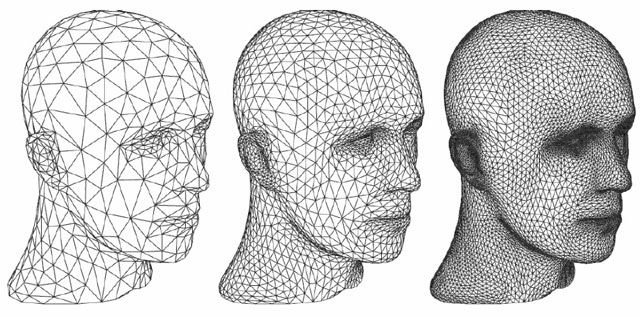
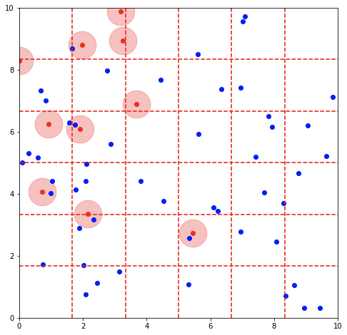

# KDTree

Данный конспект является необязательным, но будет интересным для ознакомления 
## Что такое KDTree и где используется?
До этого мы рассматривали деревья, работающие в одномерном пространстве. Но бывают случаи, когда необходимо работать в пространстве.
$KDTree$ - это разновидность дерева, применяемого в многомерном пространстве. $K$ в названии указывает на размерность в которой оно реализуется. К примеру существуют 2D-Дерево, 3D-Дерево и тд.

Одна из самых главных задач, которые решает данная структура - это поиск 
ближайшей точки (объекта). Данная функция может быть необходима, например, при разработке игр, в частности 
в так называемом ray tracing. Сложные 3D модели состоят из многочисленных треугольников и алгоритм обработки изображения требует быстро находить ближайший треугольник к заданой точке, для просчета луча света, проходящего через объект. 

#### **Cyberpunk 2077 с использованием ray tracing технологии**
 

Также KD-Дерево используется в Яндекс.Такси для поиска ближайшей свободной машины к заказчику. Здесь тоже нужна скорость, мы же не хотим заставлять клиентов долго ждать

## Принцип работы

Далее будем говорить о множестве точек на плоскости (порядка миллиона), представляющие собой 2 координаты: x и y. Но стоит помнить, что вместо них могут быть как те же треугольники, так и другие объекты, которые могут находиться не только в плоскости, но и в пространстве, 4-х мерном измерении и тд. Принцип работы координально отличаться не будет, но все же некоторые нюансы стоит учитывать.Однако на них в данном конспекте заострять внимание не будем.

Итак, предположим, что у нас есть набор точек на плоскости. Глобально алгоритм предполагает разбиение данной плоскоти на более мелкии её составляющие. Это нужно, чтобы для поиска ближайшего мы не перебирали каждый раз *все* точки плоскости, а только *часть* из их. 

Для разделения мы должны как-то обозначать границы нашей плоскости. Один способов это сделать - использовать так называемый bounding box. По сути это условные прямоугольники, в которые помещаются наши точки. Далее нам нужно как-то разделить наше пространство. Естсетвенно, разбиение, где в одном подпространстве будет 1 точка, а в другом 99999 нас не очень устраивает, так как мы хотим добиться скорости. Таких разбиений стоит избегать и строить дерево более равномерно. 

#### Как это можно сделать? 
* Один из самых простых способов - использовать случайное распределение. Даст ли это равномерное распределение? Может да, а может и нет :)
* Можно выбирать наиболее длинную сторону bounding box и делить её пополам. 
* Рассекать по медиане: отсортируем все точки по одной из координат, а медианой назовем элемент (или центр элемента), который находится на средней позиции в отсортированном списке. Секущая плоскость будет проходить через медиану так, что количество элементов слева и справа будет примерно равным.

Данные способы позволяют быстро построить дерево, но с большой вероятностью оно будет разбито неравномерно, что скажется на скорости основных функций дерева. Поэтому чтобы получить наиболее оптимальный результат данные методы не подойдут. Нужно как-то вычислить оптимальное разбиение. Для этого были придуманы функции, которые оценят выгодность конкретного разбиения. Один из примеров таких функций - $SAH$ (Surface Area Heuristic). О ней мы поговорим чуть позже.

Картинка выше - пример возможного разбиения нашего пространства.

Важно отметить, что для эффективного использования памяти координаты точек необходимо хранить в листьях нашего дерева. Сами узлы должны хранить информацию о своем bounding box.
 
Итак, у нас есть готовое дерево, теперь рассмотрим алгоритмическую составляющую поиска ближайщего к точке. 

Пусть у нас есть координаты точки, к которой мы хотим найди ближайшую. Основная идея заключается в том, чтобы найти сначала ближайший bounding box (BB) к этой точке. Затем, мы перебираем все точки в BB и выбираем точку с минимальным расстояниям. Выбрать BB можно, идя рекурсивно, начиная с корня и проверяя лежит ли наша точка в BB левого поддерева или правого. С таким подходом может быть проблема, если данная точка не лежит в BB всех точек (BB корня дерева). Чтобы учесть это следует проверять принадлежность не самой точки, а части окружности, с центром в данной точке. 

Что делать если для нашей точки подходят несколько BB? Такое может случится, если наша точка оказалась на границе раздела. В данном случае мы просто будем проверять все подходящие BB. Вы можете подумать, что это неэффективно, но на самом деле мы проверим небольшое количество BB, в сравнении со всеми точками (даже если получится очень неудачная ситуация и необходимо будет перебрать 100000 точек, это все равно в 10 раз эффективнее перебора 1000000). 

## Подробнее про SAH функцию
Давайте подробнее поговорим про SAH функцию. Как уже было сказано она нужна, чтобы оценить выгодность конкретного разбиения. Её значение вычисляется следующим образом:

Данная формула взята для случая ray tracing'а, но ее можно использовать и для других целей.

Как же ей пользоваться? Сначала мы выбираем направление (линию Ox или Oy). Затем мы делим наш BB на равные части вдоль выбранного направления. Сколько выбрать таких частей зависит от вашего желания и компромисса скорости построения KDTree и его равномерностью. Достаточно оптимальным можно считать разбинение на 33 части. Затем, каждую из этих частей мы отправляем в нашу SAH функцию. Она расчитывается для каждого из предполагаемых разбиений. Остается только выбрать ту часть, которая имеет наименьшее значение по этой функции. Оно и будет самым выгодным.

Константы $C_i$ и $C_t$ также стоит подбирать из соображений оптимальности построения KDTree и его работоспособностью.
В том же ray tracing'е, откуда была взята данная формула $C_i$ обычно равняется $1$, а $C_t$ находится в пределах $[1,2]$. 

Кроме этого с помощью SAH функции можно определить условие остановки построения дерева

Прекращаем деление, так как следующее разбиение уже не будет более выгодным

# На этом все
Это была краткая справка о том, что вообще из себя представляет KDTree и какие алгортмы лежат в его реализации. Подробнее о создании данного типа деревьев можно почитать [здесь](https://habr.com/ru/articles/312882/). А также на [википедии](https://ru.wikipedia.org/wiki/K-d-дерево)