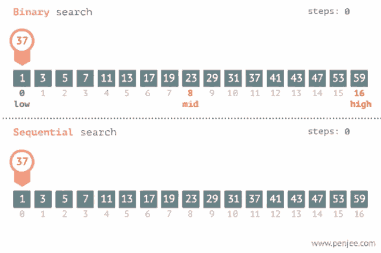

# Массив. Линейный поиск. Бинарный поиск

## 1. Что такое массив

Массив — это структура данных, в которой элементы лежат подряд в памяти и
доступны по индексу.

Пример:

```cpp
int a[5] = {10, 20, 30, 40, 50};
```

Если известен индекс, адрес элемента можно вычислить очень быстро, поэтому
доступ по индексу выполняется за `O(1)`.

## 2. Почему массив так важен

Массив — одна из самых базовых структур в программировании. На нём строятся:

- динамические массивы;
- стек на массиве;
- куча;
- таблицы и матрицы;
- многие алгоритмы сортировки и поиска.

## 3. Плюсы массива

- быстрый доступ по индексу `O(1)`;
- хорошая локальность данных в памяти;
- простая модель хранения;
- удобно обходить последовательно.

## 4. Минусы массива

- вставка в середину требует сдвига элементов;
- удаление из середины тоже требует сдвига;
- статический массив имеет фиксированный размер.

Из-за этого массив очень хорош для чтения и последовательной обработки, но не
так удобен для частых локальных модификаций.

## 5. Линейный поиск

### Когда он нужен

Линейный поиск хорош, если:

- массив не отсортирован;
- структура данных очень простая;
- размер входа невелик;
- важна универсальность.

### Идея

Идём по элементам слева направо и сравниваем каждый с искомым значением.

### Код

```cpp
int LinearSearch(const std::vector<int>& values, int target) {
  for (int i = 0; i < static_cast<int>(values.size()); ++i) {
    if (values[i] == target) {
      return i;
    }
  }
  return -1;
}
```

### Сложность

- лучший случай: `O(1)` — элемент стоит первым;
- худший случай: `O(n)` — элемент последний или его нет.

### Плюсы

- работает без сортировки;
- очень простой;
- применим почти везде.

### Минусы

- плохо масштабируется на больших входах.

## 6. Бинарный поиск

### Главное условие

Бинарный поиск работает **только на отсортированном массиве**.

Это его главная цена: нужно либо изначально иметь порядок, либо сначала
отсортировать данные.

### Идея

На каждом шаге берём середину текущего диапазона.

- если середина равна искомому — нашли ответ;
- если искомое меньше — отбрасываем правую половину;
- если больше — отбрасываем левую.

То есть за один шаг мы выбрасываем примерно половину вариантов.

### Код

```cpp
int BinarySearch(const std::vector<int>& values, int target) {
  int left = 0;
  int right = static_cast<int>(values.size()) - 1;

  while (left <= right) {
    int mid = left + (right - left) / 2;
    if (values[mid] == target) {
      return mid;
    }
    if (values[mid] < target) {
      left = mid + 1;
    } else {
      right = mid - 1;
    }
  }

  return -1;
}
```

### Почему середину считают так

Часто пишут:

```cpp
mid = left + (right - left) / 2;
```

а не `(left + right) / 2`, чтобы избежать переполнения.

## 7. Сложность бинарного поиска

На каждом шаге размер диапазона уменьшается примерно в 2 раза. Поэтому число
шагов порядка:

```text
log2(n)
```

Итоговая сложность:

```text
O(log n)
```

## 8. Визуальная схема



## 9. Сравнение линейного и бинарного поиска

| Критерий | Линейный поиск | Бинарный поиск |
|---|---|---|
| Нужна сортировка | нет | да |
| Худшая сложность | `O(n)` | `O(log n)` |
| Простота | очень простой | чуть сложнее |
| Универсальность | высокая | только отсортированные данные |

## 10. Когда бинарный поиск особенно хорош

- много запросов к одному и тому же отсортированному набору;
- поиск границ, позиций, первого/последнего вхождения;
- задачи “найти минимальный/максимальный допустимый ответ”.

## 11. Частые ошибки

- запускать бинарный поиск по неотсортированному массиву;
- ошибаться с границами `left` и `right`;
- неправильно обновлять половины;
- путать поиск значения и поиск границы.

## 12. Что важно запомнить

Массив даёт быстрый доступ по индексу.
Линейный поиск работает всегда, но медленный.
Бинарный поиск требует порядка, зато резко ускоряет поиск за счёт деления
диапазона пополам.
