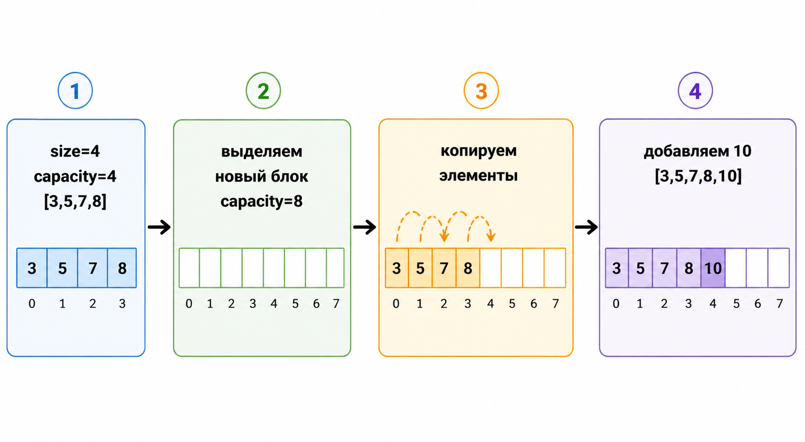

# Динамический массив

## Что это такое

Динамический массив — это структура данных, которая хранит элементы подряд в
памяти, как обычный массив, но при этом умеет увеличивать вместимость по мере
необходимости. В C++ классический пример — `std::vector`.

Обычно внутри хранятся три вещи:

- указатель на начало блока памяти;
- `size` — сколько элементов реально лежит в структуре;
- `capacity` — сколько элементов можно хранить без нового выделения памяти.

## Почему обычного массива недостаточно

У статического массива размер фиксирован заранее. Если место закончилось,
приходится создавать новый массив и переносить данные вручную. Динамический
массив автоматизирует этот процесс.

## Базовые операции

| Операция | Идея | Сложность |
|---|---|---|
| Доступ по индексу | адрес вычисляется напрямую | `O(1)` |
| Добавление в конец | либо вставляем сразу, либо расширяемся | амортизированно `O(1)` |
| Удаление из конца | уменьшаем `size` | `O(1)` |
| Вставка в середину | нужно сдвигать хвост | `O(n)` |
| Удаление из середины | нужно сдвигать хвост | `O(n)` |

## Как работает `push_back`

Если `size < capacity`, новый элемент просто кладётся в конец.

Если места нет:

1. выбирается новая вместимость, обычно в 2 раза больше старой;
2. выделяется новый блок памяти;
3. туда копируются или переносятся старые элементы;
4. старая память освобождается;
5. новый элемент записывается в конец.



## Практический пример

Было:

```text
[3, 5, 7, 8]
size = 4
capacity = 4
```

После `push_back(10)`:

```text
[3, 5, 7, 8, 10]
size = 5
capacity = 8
```

## Плюсы

- быстрый доступ по индексу;
- хорошая локальность данных в памяти;
- простая модель хранения;
- отлично подходит для стека, буфера, таблиц, списков значений.

## Минусы

- вставка и удаление в середине дорогие;
- при расширении происходит дорогое копирование;
- иногда структура держит запас памяти больше, чем реально используется.

## Где используется

- `std::vector` в C++;
- таблицы значений;
- стек на массиве;
- база для многих алгоритмов сортировки и поиска.

## Что важно запомнить

Динамический массив — это компромисс между скоростью доступа `O(1)` и редкими,
но дорогими расширениями памяти. Именно поэтому дальше в курсе нам нужен
амортизационный анализ.

