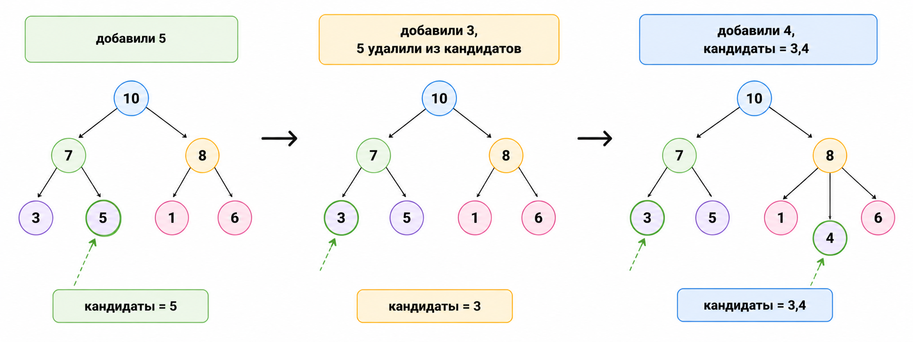

# Поддержка минимума в очереди

## Задача

Нужно реализовать очередь, которая умеет:

- добавлять элементы;
- удалять элементы из начала;
- быстро отвечать на запрос минимума.

Хотелось бы, чтобы минимум получался за `O(1)`.

## Подход 1. Два стека с минимумом

Если у нас уже есть `min-stack`, можно построить очередь из двух таких стеков:

- `in` — для новых элементов;
- `out` — для выдачи.

Минимум тогда вычисляется так:

```text
min(min(in), min(out))
```

если оба стека не пусты.

### Преимущество

- очень красивая композиция уже известных структур.

### Недостаток

- это не самая наглядная реализация для задач на окно.

## Подход 2. Монотонная очередь

Этот способ особенно полезен в задачах на скользящее окно.

Храним:

- обычную очередь всех элементов;
- дополнительный дек кандидатов на минимум.

### Добавление `x`

Пока в конце дека стоят элементы больше `x`, удаляем их. Затем добавляем `x` в
конец дека.

### Удаление из начала

Если удаляемый элемент совпал с головой дека, удаляем его и оттуда тоже.

### Запрос минимума

Минимум всегда хранится в голове дека.

## Почему это работает

В деке остаются только элементы, которые ещё могут когда-нибудь стать минимумом.
Все заведомо худшие кандидаты выталкиваются.



## Сложность

Каждый элемент:

- один раз добавляется;
- не более одного раза удаляется.

Поэтому все операции работают за `O(1)` амортизированно.

## Сводная таблица практических характеристик

Нужно различать:

- обычную очередь;
- очередь с минимумом.

Во втором случае мы специально платим дополнительной структурой за то, чтобы
минимум получать мгновенно.

| Свойство | Оценка |
|---|---|
| Память | `O(n)` |
| Узнать длину | `O(1)` |
| Взять максимум | `O(n)`, если отдельно не поддерживать максимум |
| Добавить элемент | `O(1)` амортизированно |
| Взять минимум | `O(1)` |

## Где используется

- минимум на скользящем окне;
- потоковая обработка данных;
- задачи, где нужен онлайн-минимум на префиксах или окнах.
