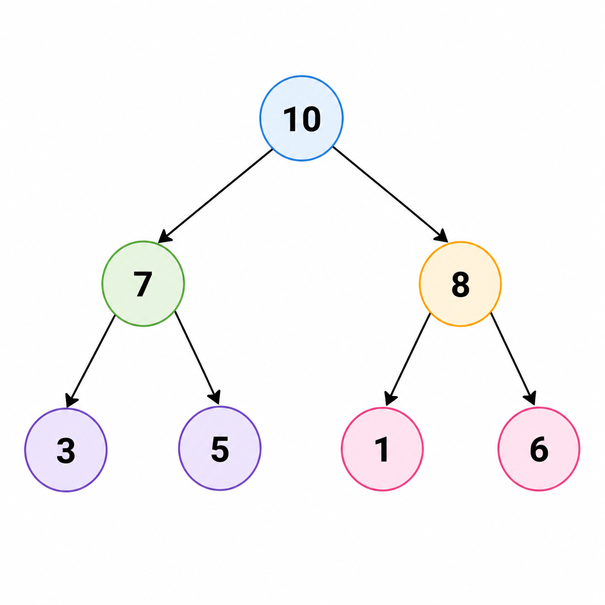
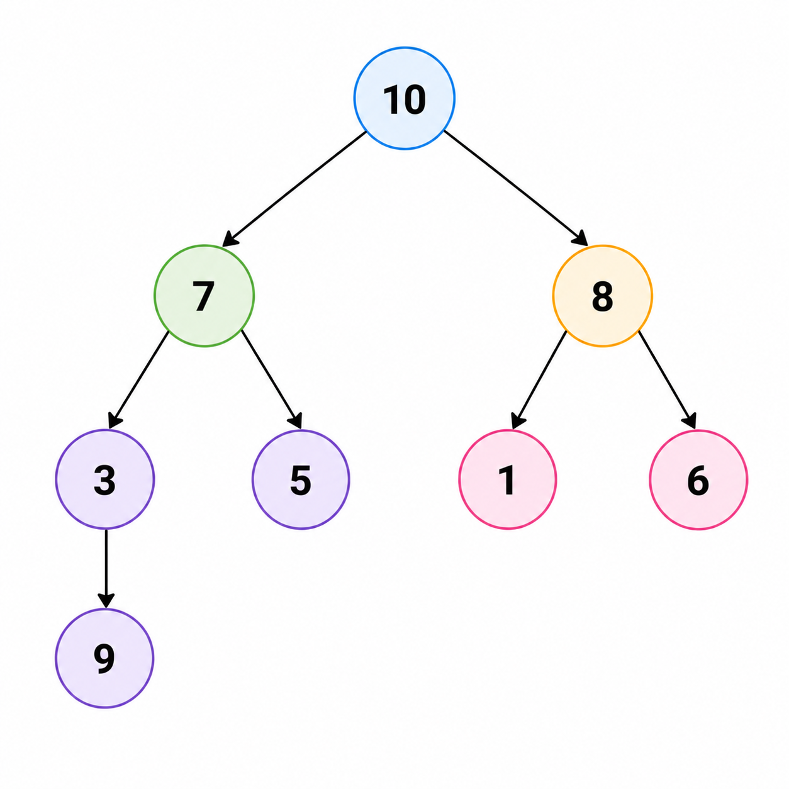

# Двоичная куча. АТД «Очередь с приоритетом»

## 1. Что такое очередь с приоритетом

Обычная очередь выдаёт элементы в порядке прихода:

```text
FIFO
```

Очередь с приоритетом работает иначе:

- у каждого элемента есть “важность”;
- раньше извлекается элемент с лучшим приоритетом.

В зависимости от задачи нас может интересовать:

- либо максимум — тогда структура называется `max-priority queue`;
- либо минимум — тогда `min-priority queue`.

## 2. Какие операции должен уметь АТД

Очередь с приоритетом как абстрактный тип данных должна поддерживать:

- `push(x)` — добавить новый элемент;
- `top()` / `get_max()` / `get_min()` — узнать лучший элемент;
- `extract_max()` / `extract_min()` — удалить и вернуть лучший элемент;
- иногда `empty()` и `size()`.

Главное отличие от обычной очереди:

- порядок выдачи определяется не временем вставки;
- а отношением порядка между самими значениями.

## 3. Почему двоичная куча — классическая реализация

Двоичная куча (`binary heap`) — одна из самых популярных реализаций очереди с
приоритетом, потому что она одновременно:

- довольно проста;
- хорошо работает на практике;
- даёт сильные гарантии по времени.

## 4. Что такое двоичная куча

Будем говорить про `max-heap`. Для `min-heap` всё симметрично.

У двоичной кучи есть два главных свойства.

### Свойство 1. Кучное свойство

Для каждой вершины:

```text
value(parent) >= value(child)
```

То есть значение в родителе не меньше значений детей.

Следствие:

- самый большой элемент всегда находится в корне.

### Свойство 2. Почти полное бинарное дерево

Куча не может иметь произвольную форму. Её уровни заполняются:

- сверху вниз;
- слева направо;
- без дырок внутри уровня.

Это свойство очень важно, потому что именно оно позволяет хранить кучу в
массиве.

## 5. Почему кучу удобно хранить в массиве

Из-за почти полного вида дерева вершины можно записать подряд.

Если корень хранится в индексе `1`, то для вершины `i`:

- левый сын: `2i`;
- правый сын: `2i + 1`;
- родитель: `i / 2`.

Если корень хранится в `0`, формулы будут немного другими, но идея та же.

## 6. Визуальная картина



Этому дереву соответствует массив:

```text
[10, 7, 8, 3, 5, 1, 6]
```

Если смотреть сверху вниз, слева направо, именно в таком порядке вершины и
попадают в массив.

## 7. Почему `top()` работает за `O(1)`

Самый важный вывод из кучного свойства:

- лучший элемент всегда в корне.

А корень — это:

- первая вершина дерева;
- первый элемент массива.

Значит операция `top()` просто читает один элемент:

```text
heap[1]
```

или `heap[0]` в нулевой индексации.

Никаких проходов, циклов или перестроений не нужно. Поэтому:

```text
top = O(1)
```

## 8. Операция `push`

### Идея

Новый элемент нельзя вставлять в случайное место, иначе сломается форма дерева.
Поэтому:

1. элемент добавляют в конец массива;
2. то есть в самую правую позицию последнего уровня;
3. потом, если кучное свойство нарушилось, элемент поднимают вверх.

Этот процесс называется:

```text
sift up
```

или “просеивание вверх”.

### Пошаговый пример

Пусть была куча:

```text
[10, 7, 8, 3, 5, 1, 6]
```

Добавим `9`.

Сначала просто допишем его в конец:

```text
[10, 7, 8, 3, 5, 1, 6, 9]
```

Теперь дерево:




Здесь видно нарушение:

- `9 > 3`, значит кучное свойство сломалось.

Меняем `9` с родителем:

```text
[10, 7, 8, 9, 5, 1, 6, 3]
```

Теперь `9 > 7`, значит поднимаем ещё раз:

```text
[10, 9, 8, 7, 5, 1, 6, 3]
```

Дальше `9 < 10`, значит на этом всё.

## 9. Почему `push = O(log n)`

При `sift up` элемент движется только вверх по пути от листа к корню.

Длина такого пути не больше высоты дерева.

У почти полного бинарного дерева высота:

```text
O(log n)
```

Значит в худшем случае элемент сделает не больше `O(log n)` обменов.

Поэтому:

```text
push = O(log n)
```

## 10. Операция `extract_max`

### Почему нельзя просто удалить корень

Корень — это первый элемент массива и вершина, от которой зависят оба
инварианта:

- форма дерева;
- кучное свойство.

Если удалить корень “просто так”, в дереве появится дырка.

### Правильная схема

1. сохраняем значение корня как ответ;
2. переносим на его место последний элемент массива;
3. уменьшаем размер кучи;
4. опускаем новый корень вниз, пока не восстановится кучное свойство.

Этот процесс называется:

```text
sift down
```

или “просеивание вниз”.

### Пример

Была куча:

```text
[10, 9, 8, 7, 5, 1, 6, 3]
```

Удаляем максимум `10`.

Ставим на его место последний элемент `3`:

```text
[3, 9, 8, 7, 5, 1, 6]
```

Теперь `3` меньше детей `9` и `8`, значит кучное свойство нарушено.

Меняем `3` с большим ребёнком `9`:

```text
[9, 3, 8, 7, 5, 1, 6]
```

Теперь `3` сравнивается со своими детьми `7` и `5`. Меняем с `7`:

```text
[9, 7, 8, 3, 5, 1, 6]
```

Теперь свойство кучи восстановлено.

## 11. Почему `extract_max = O(log n)`

При `sift down` элемент движется только вниз по одному пути.

Он не может пройти больше высоты дерева, а высота кучи:

```text
O(log n)
```

Следовательно:

```text
extract_max = O(log n)
```

## 12. Почему высота кучи логарифмическая

Из-за свойства почти полного дерева.

Если дерево заполнено по уровням, то:

- на уровне 0 — 1 вершина;
- на уровне 1 — до 2 вершин;
- на уровне 2 — до 4 вершин;
- ...

То есть число вершин растёт как:

```text
1 + 2 + 4 + ... + 2^h
```

Отсюда следует:

```text
h = O(log n)
```

Именно поэтому все операции, которые идут по одному пути вверх или вниз, дают
логарифм.

## 13. Построение кучи `build_heap`

Вот здесь часто возникает главный вопрос:

> если `sift down` стоит `O(log n)`, почему построение всей кучи не `O(n log n)`?

Очень хороший вопрос.

### Наивный способ

Можно строить кучу так:

1. начинать с пустой;
2. вставлять элементы по одному через `push`.

Тогда действительно получится:

```text
n * O(log n) = O(n log n)
```

### Более умный способ

Можно взять готовый массив и “просеять вниз” все внутренние вершины, начиная с
последней внутренней и двигаясь к корню.

Почему это лучше:

- очень много вершин лежат близко к листьям;
- для них `sift down` очень короткий;
- длинное просеивание нужно только для нескольких верхних вершин.

### Интуитивное объяснение линейности

В дереве:

- половина вершин — листья, им не нужно ничего делать;
- четверть вершин находятся на высоте 1;
- ещё меньше вершин на высоте 2;
- и так далее.

То есть дорогих операций мало, а дешёвых — много.

Суммарная стоимость оказывается:

```text
O(n)
```

а не `O(n log n)`.

## 14. Сводная таблица сложностей

| Операция | Почему такая сложность | Итог |
|---|---|---|
| `top` | читаем корень | `O(1)` |
| `push` | поднимаем элемент вверх по высоте | `O(log n)` |
| `extract_max` | опускаем элемент вниз по высоте | `O(log n)` |
| `build_heap` | много коротких `sift down`, мало длинных | `O(n)` |

## 15. Сводная таблица практических характеристик

| Свойство | Оценка | Почему |
|---|---|---|
| Память | `O(n)` | элементы лежат в массиве |
| Узнать длину | `O(1)` | достаточно хранить размер кучи |
| Взять максимум | `O(1)` в `max-heap` | максимум всегда в корне |
| Добавить элемент | `O(log n)` | элемент поднимается не выше высоты дерева |

## 16. Сравнение с другими структурами

### Куча vs BST

| Структура | Сильная сторона | Слабая сторона |
|---|---|---|
| Куча | быстро брать максимум/минимум | не хранит полный порядок |
| BST | полный упорядоченный доступ | экстремум не единственный фокус |

Куча не умеет быстро:

- найти произвольный элемент;
- делать in-order обход;
- отвечать на запросы диапазонов.

Она специально заточена под экстремум.

## 17. Где куча используется

- `heap sort`;
- алгоритм Дейкстры;
- обработка событий по приоритету;
- задачи на `top-k`;
- online-задачи, где постоянно нужен текущий минимум или максимум.

## 18. Типичные ошибки в понимании

- думать, что куча — это полностью отсортированное дерево;
- считать, что у любого узла левый ребёнок меньше правого или наоборот;
- путать свойство “родитель лучше детей” с полным порядком между всеми
  вершинами.

Очень важно:

куча гарантирует порядок только **по вертикали между родителем и детьми**, а не
между всеми узлами дерева.

## 19. Что важно запомнить

Сильные оценки кучи получаются из двух идей:

1. дерево почти полное, значит его высота логарифмическая;
2. операции `push` и `extract` двигают элемент только по одному пути вверх или
   вниз.

Именно поэтому:

- `top = O(1)`;
- `push = O(log n)`;
- `extract = O(log n)`;
- `build_heap = O(n)`.
