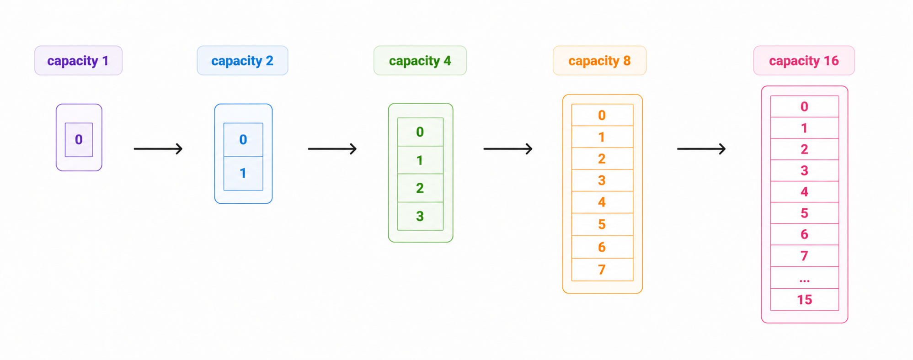

# Амортизированное время добавления элемента в динамический массив

## Формулировка

Нужно понять, почему операция добавления в конец динамического массива работает
не за `O(n)`, а амортизированно за `O(1)`.

## Почему возникает сомнение

Когда массив переполняется, приходится копировать все элементы в новый блок.
Если в массиве уже `n` элементов, такая операция действительно стоит `O(n)`.

Из-за этого кажется, что и `push_back` должен быть дорогим.

## Ключевая мысль

Дорогие операции происходят редко. Если вместимость каждый раз увеличивается,
например, в 2 раза, то между двумя расширениями успевает выполниться много
дешёвых вставок.

## Пример роста вместимости

Пусть `capacity` меняется так:

```text
1, 2, 4, 8, 16, 32, ...
```

Чтобы сделать `n` вставок, нам придётся скопировать элементы примерно в такие
моменты:

```text
1 + 2 + 4 + 8 + ... < 2n
```

Это геометрическая прогрессия.

## Итоговая оценка

За `n` операций:

- сами вставки стоят `n`;
- все копирования вместе стоят меньше `2n`.

Значит суммарная работа не превосходит константы, умноженной на `n`, а средняя
цена одной операции равна:

```text
O(n) / n = O(1)
```

## Геометрическая интуиция



Каждое следующее дорогое копирование случается реже, чем предыдущее.

## Что будет, если увеличивать вместимость плохо

Если увеличивать массив не в 2 раза, а, например, каждый раз только на 1, то
получится:

```text
1 + 2 + 3 + ... + n = O(n^2)
```

Тогда средняя стоимость одной вставки станет `O(n)`, и структура потеряет своё
главное преимущество.

## Вывод

Амортизированное `O(1)` получается не магией, а из-за правильной стратегии роста
вместимости: редкие дорогие операции компенсируются большим числом дешёвых.

