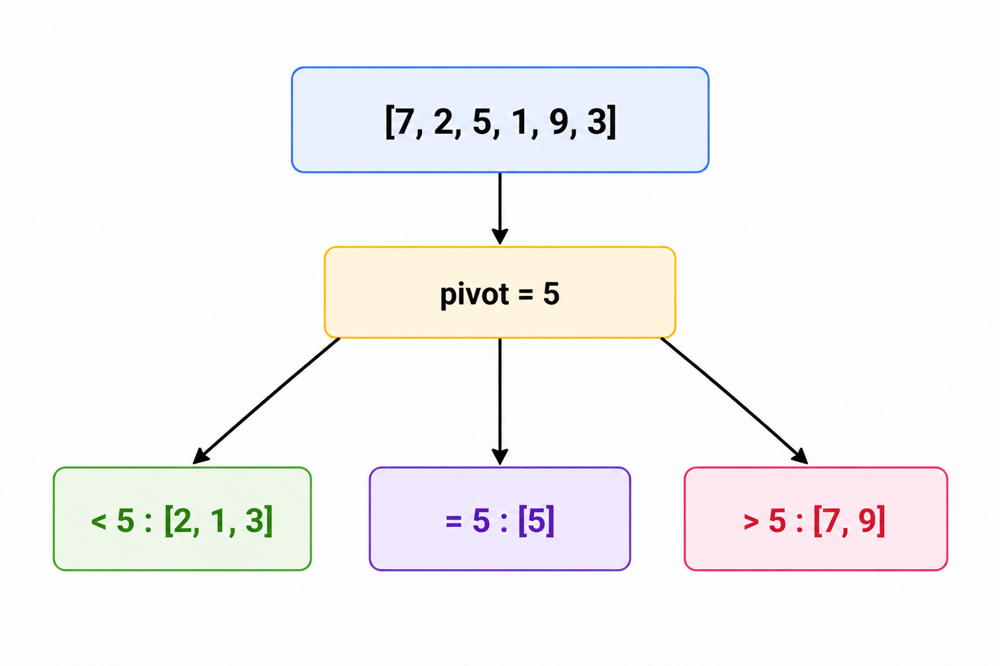
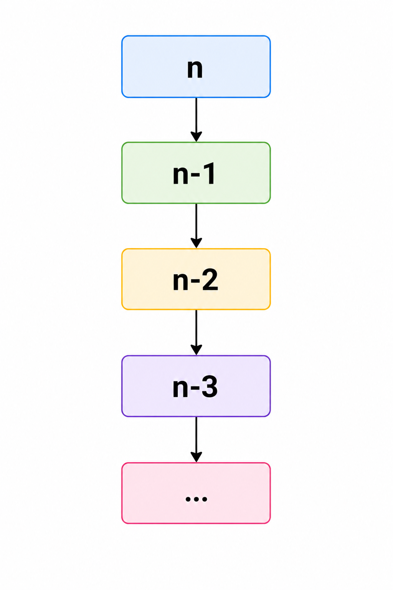
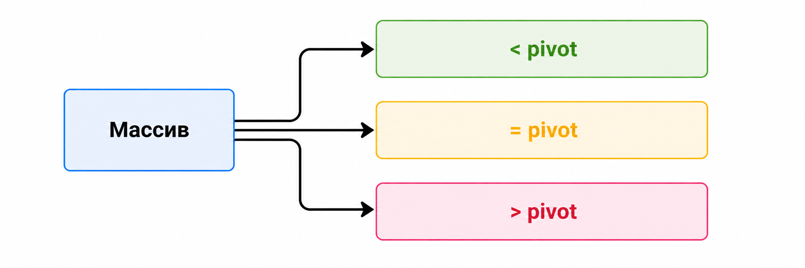

# Быстрая сортировка. Выбор опорного элемента. Доказательство среднего времени работы

## 1. Почему quick sort считается одной из главных сортировок

`Quick sort` — это одна из самых известных сравнительных сортировок, потому что
она одновременно:

- концептуально красива;
- очень быстра на практике;
- строится на простой идее “разделяй и властвуй”;
- лежит в основе большого числа промышленных реализаций сортировки.

Если `merge sort` часто воспринимается как “академически аккуратная”
сортировка, то `quick sort` — это сортировка, которую очень важно чувствовать
интуитивно: почему она обычно быстрая, почему иногда может деградировать и
какую роль играет выбор опорного элемента.

---

## 2. Главная идея

Вместо того чтобы сразу ставить все элементы на правильные места, `quick sort`
делает более локальный и очень сильный шаг:

1. выбирает **опорный элемент** `pivot`;
2. переставляет массив так, чтобы:
   - слева оказались элементы `< pivot`;
   - посередине — элементы `= pivot`;
   - справа — элементы `> pivot`;
3. рекурсивно сортирует левую и правую части.

Ключевая мысль:

после `partition` опорный элемент уже **разделил пространство значений**.
Элементы из левой части никогда не должны перескочить направо, а элементы из
правой части — налево.



После этого задача “отсортировать весь массив” превращается в две более
маленькие задачи того же типа.

### Визуально


---

## 3. Как на это смотреть интуитивно

Очень полезно воспринимать `quick sort` не как “сортировку перестановками”, а
как алгоритм, который многократно отвечает на вопрос:

> Какие элементы должны лежать левее выбранной границы, а какие правее?

То есть `quick sort` постоянно уточняет глобальный порядок через серию локальных
разделений.

Это похоже на быструю организацию пространства:

- сначала делим массив крупно;
- потом делим крупные блоки на меньшие;
- потом меньшие ещё на меньшие;
- и в какой-то момент каждый блок становится либо пустым, либо из одного
  элемента.

---

## 4. Что такое partition

`Partition` — это центральная операция `quick sort`.

Её задача:

- пройти по текущему участку массива;
- переставить элементы так, чтобы они разошлись по разные стороны от `pivot`.

Именно здесь тратится почти вся работа на одном уровне рекурсии.

Если `partition` сделан хорошо, то:

- один уровень работает линейно;
- дальше остаются две меньшие подзадачи.

---

## 5. Простейший conceptual example

Пусть массив:

```text
[8, 3, 1, 7, 0, 10, 2]
```

Выберем:

```text
pivot = 7
```

После разбиения хотим получить что-то такого вида:

```text
[3, 1, 0, 2 | 7 | 8, 10]
```

Важно:

- левая часть сама по себе ещё не обязана быть отсортирована;
- правая часть тоже не обязана быть отсортирована;
- но все элементы уже попали в **правильную сторону относительно 7**.

И это уже очень сильный прогресс.

---

## 6. Почему одного partition недостаточно

После одного разбиения мы знаем только отношение элементов к `pivot`.

Например, если слева лежит:

```text
[3, 1, 0, 2]
```

то это ещё не отсортированный массив.

Нужно снова выбрать pivot уже внутри этой части и повторить процесс.

Именно поэтому `quick sort` естественно рекурсивен:

- одна и та же идея применяется к подмассивам;
- каждый вызов уменьшает размер задачи.

---

## 7. Базовый рекурсивный шаблон

```text
quick_sort(A, l, r):
    if l >= r:
        return

    pivot = choose_pivot(A, l, r)
    m = partition(A, l, r, pivot)

    quick_sort(A, left_part)
    quick_sort(A, right_part)
```

Базовый случай:

- пустой массив уже отсортирован;
- массив из одного элемента тоже отсортирован.

---

## 8. Два популярных стиля partition

На практике чаще всего встречаются:

- схема Ломуто (`Lomuto partition`);
- схема Хоара (`Hoare partition`).

Обе решают одну и ту же задачу, но делают это немного по-разному.

### Lomuto

Плюсы:

- проще понять с нуля;
- удобна для первого изучения.

Минусы:

- обычно делает больше обменов;
- чувствительнее к некоторым плохим входам.

### Hoare

Плюсы:

- часто эффективнее;
- делает меньше лишних swap.

Минусы:

- сложнее в доказательстве и аккуратной реализации;
- легче ошибиться в границах цикла.

---

## 9. Пошаговая идея схемы Ломуто

Представим, что `pivot` уже стоит в конце.

Мы поддерживаем границу:

- слева уже собраны элементы `< pivot`;
- справа от этой границы лежат ещё не до конца обработанные элементы.

Пробегаем массив слева направо:

- если текущий элемент `< pivot`, расширяем левую “хорошую” зону;
- иначе оставляем его в правой части.

В конце ставим `pivot` между этими частями.

### Визуально

```text
[ < pivot | обработано, но >= pivot | ещё не просмотрено | pivot ]
```

По мере прохода левая зона растёт.

---

## 10. Пошаговый пример partition

Пусть:

```text
[4, 2, 7, 1, 8, 3, 6]
```

Выберем:

```text
pivot = 6
```

Тогда хотим получить массив вида:

```text
[4, 2, 1, 3 | 6 | 7, 8]
```

Посмотрим на элементы по одному:

1. `4 < 6` — оставляем слева.
2. `2 < 6` — тоже слева.
3. `7 > 6` — остаётся в правой зоне.
4. `1 < 6` — его надо переставить в левую часть.
5. `8 > 6` — справа.
6. `3 < 6` — тоже уходит влево.

В конце `6` ставится на границу между двумя зонами.

Самое важное:

мы не пытаемся отсортировать левую зону прямо сейчас. Мы только делим массив на
логически правильные области.

---

## 11. Почему partition работает за `O(n)`

Потому что на одном уровне мы просто:

- один раз проходим по подмассиву;
- делаем константное число операций на элемент.

То есть если длина подмассива `n`, то:

```text
partition = O(n)
```

Это фундаментально важно для всей оценки `quick sort`.

---

## 12. Откуда берётся рекуррентное соотношение

После одного `partition` массив разбивается на две части размеров:

```text
k и n - k - 1
```

Тогда время работы можно записать так:

```text
T(n) = T(k) + T(n - k - 1) + O(n)
```

где:

- `T(k)` — сортировка левой части;
- `T(n - k - 1)` — сортировка правой части;
- `O(n)` — текущий `partition`.

Всё поведение алгоритма определяется именно тем, **насколько удачно разбивается
массив**.

---

## 13. Лучший случай

Если разбиение каждый раз почти пополам:

```text
T(n) = 2T(n/2) + O(n)
```

то получаем:

```text
T(n) = O(n log n)
```

Это тот же тип рекурсии, что и у `merge sort`.

Интуитивно:

- уровней рекурсии около `log n`;
- на каждом уровне суммарно обрабатывается `n` элементов.

Значит:

```text
n + n + n + ... (log n раз) = O(n log n)
```

---

## 14. Средний случай

Самое важное свойство `quick sort`:

даже если разбиения не идеально пополам, но **в среднем достаточно хорошие**,
то средняя сложность всё равно остаётся:

```text
O(n log n)
```

Почему это разумно:

- редко бывает, что pivot каждый раз идеально делит массив;
- но и редко бывает, что он каждый раз даёт почти худшее разбиение;
- при случайном выборе pivot массив обычно делится “достаточно сбалансированно”.

Именно поэтому в среднем `quick sort` работает очень хорошо.

---

## 15. Интуитивное доказательство среднего `O(n log n)`

Строгое доказательство обычно идёт через математическое ожидание, но на уровне
интуиции полезно запомнить такую картину:

1. На одном уровне рекурсии суммарная работа — `O(n)`.
2. Если pivot в среднем не слишком плохой, глубина рекурсии остаётся порядка
   `log n`.
3. Поэтому средняя суммарная работа:

```text
O(n log n)
```

Можно думать так:

- каждый элемент участвует в серии разбиений;
- число “значимых уровней”, через которые он проходит, в среднем логарифмическое.

---

## 16. Худший случай

Худший случай возникает, если `pivot` каждый раз оказывается почти крайним:

- минимумом;
- или максимумом.

Тогда разбиение получается таким:

```text
n -> n-1 и 0
```

Значит рекурсия имеет вид:

```text
T(n) = T(n-1) + O(n)
```

А это уже:

```text
O(n^2)
```

### Визуально



То есть вместо широкого дерева рекурсии мы получаем почти линейную цепочку.

---

## 17. Когда худший случай особенно вероятен

Если брать pivot наивно, например всегда:

- первый элемент;
- последний элемент,

то на уже отсортированном или почти отсортированном массиве можно легко словить
плохой сценарий.

Пример:

```text
[1, 2, 3, 4, 5, 6, 7]
```

Если всегда брать первый элемент, то он будет минимумом, и разбиения станут:

```text
0 и n-1
```

на каждом шаге.

---

## 18. Почему выбор pivot так важен

`Quick sort` в каком-то смысле живёт и умирает вместе с качеством `pivot`.

Хороший `pivot`:

- делит массив на сопоставимые части;
- делает дерево рекурсии низким;
- приводит к `O(n log n)`.

Плохой `pivot`:

- порождает сильно перекошенные разбиения;
- увеличивает глубину рекурсии;
- может довести алгоритм до `O(n^2)`.

Именно поэтому вопрос выбора pivot — не косметика, а центральная часть темы.

---

## 19. Популярные стратегии выбора pivot

### Первый элемент

Плюсы:

- очень просто.

Минусы:

- легко ломается на отсортированных данных.

### Последний элемент

Плюсы:

- тоже просто.

Минусы:

- те же проблемы с плохими входами.

### Случайный элемент

Плюсы:

- резко снижает вероятность систематически плохих разбиений;
- хорош для практики и анализа среднего случая.

Минусы:

- добавляет случайность;
- требует генерации случайного индекса.

### Median of three

Берут медиану из:

- первого элемента;
- среднего;
- последнего.

Плюсы:

- часто устойчивее к уже отсортированным данным;
- обычно даёт лучшее разбиение, чем просто первый или последний элемент.

Минусы:

- всё ещё не гарантирует идеального поведения;
- чуть сложнее реализации.

---

## 20. Что такое median of three интуитивно

Если взять только первый элемент, можно случайно выбрать экстремум.

Если же посмотреть на три точки:

- начало;
- середину;
- конец,

то шанс выбрать совсем плохой pivot становится меньше.

Это не магия и не строгая гарантия, но очень практичная эвристика.

```text
first = 1
middle = 8
last = 5

median(first, middle, last) = 5
```

Такой pivot часто лучше отражает “центр” текущего подмассива.

---

## 21. Что делать с множеством равных элементов

Если в массиве много повторов, обычное двухстороннее разбиение может работать
неидеально.

Поэтому часто используют **трёхпутевое разбиение**:

- `< pivot`
- `= pivot`
- `> pivot`

Это особенно полезно, когда массив содержит много одинаковых значений.



Тогда не нужно бесконечно рекурсировать по большим блокам одинаковых элементов.

---

## 22. Реализация на C++

Ниже показана одна из самых понятных версий: `quick sort` с разбиением Ломуто и
случайным выбором `pivot`.

```cpp
int Partition(std::vector<int>& a, int left, int right) {
  int pivot = a[right];
  int i = left;

  for (int j = left; j < right; ++j) {
    if (a[j] < pivot) {
      std::swap(a[i], a[j]);
      ++i;
    }
  }

  std::swap(a[i], a[right]);
  return i;
}

void QuickSort(std::vector<int>& a, int left, int right) {
  if (left >= right) {
    return;
  }

  int pivot_index = left + std::rand() % (right - left + 1);
  std::swap(a[pivot_index], a[right]);

  int mid = Partition(a, left, right);
  QuickSort(a, left, mid - 1);
  QuickSort(a, mid + 1, right);
}
```

---

## 23. Сводная таблица свойств

| Алгоритм | Лучший случай | Худший случай | Доп. память | Узнать длину | Взять максимум | Добавить элемент | Устойчивость |
|---|---|---|---|---|---|---|---|
| Quick sort | `O(n log n)` | `O(n^2)` | среднее `O(log n)`, худшее `O(n)` на стек | `O(1)` | `O(1)` | `O(n)` | нет |

---

## 24. Память и рекурсия

`Quick sort` часто называют `in-place` сортировкой, потому что:

- он не требует отдельного массива размера `n`, как `merge sort`;
- перестановки происходят внутри исходного массива.

Но нужно помнить:

- рекурсия использует стек вызовов;
- значит полностью бесплатной по памяти сортировка не является.

Обычно:

- средняя дополнительная память — `O(log n)` на стек;
- в худшем случае — `O(n)`, если рекурсия выродилась.

---

## 25. Почему quick sort часто быстрее merge sort на практике

Хотя обе сортировки в среднем дают `O(n log n)`, на обычных массивах в памяти
`quick sort` часто выигрывает за счёт:

- меньших констант;
- локальности памяти;
- отсутствия большого вспомогательного массива;
- хорошего поведения на реальных данных при хорошем выборе pivot.

Это очень важный практический момент:

асимптотика — это не всё.  
Две сортировки с одинаковым `O(n log n)` могут сильно отличаться по реальному
времени.

---

## 26. Когда quick sort неудобен

Есть ситуации, где его слабые стороны становятся заметны:

- если нужна **устойчивость**;
- если важна жёсткая гарантия худшего случая `O(n log n)`;
- если нельзя позволить себе риск глубокой рекурсии;
- если данные устроены так, что плохие pivot’ы особенно вероятны.

В таких случаях:

- `merge sort` может быть надёжнее;
- `heap sort` может быть безопаснее по худшему случаю.

---

## 27. Сравнение с merge sort и heap sort

| Алгоритм | Среднее время | Худший случай | Доп. память | Устойчивость | Практика |
|---|---|---|---|---|---|
| Quick sort | `O(n log n)` | `O(n^2)` | обычно `O(log n)` на стек | нет | очень быстр |
| Merge sort | `O(n log n)` | `O(n log n)` | `O(n)` | да | стабилен и предсказуем |
| Heap sort | `O(n log n)` | `O(n log n)` | `O(1)` + стек/итеративность | нет | часто медленнее quick sort |

Эта таблица очень полезна для устного ответа:

- `quick sort` силён в среднем и на практике;
- `merge sort` силён по стабильности и предсказуемости;
- `heap sort` силён по памяти и худшему случаю.

---

## 28. Типичные ошибки в понимании

### Ошибка 1. После partition левая часть уже отсортирована

Нет. Она только состоит из элементов, которые меньше `pivot`.

### Ошибка 2. Quick sort всегда `O(n log n)`

Нет. Только в среднем и в хорошем случае. Худший случай — `O(n^2)`.

### Ошибка 3. Pivot обязан встать на своё окончательное место в каждой схеме

Это зависит от конкретной схемы partition и формулировки инварианта.

### Ошибка 4. Quick sort обязательно лучше всех

Нет. Он просто очень хорош в большом количестве практических сценариев.

---

## 29. Где quick sort используется как идея

Даже если конкретно сортировку вы не вызываете, идея `partition` часто живёт
дальше в других алгоритмах.

Например:

- `quickselect` для поиска `k`-й порядковой статистики;
- задачи на разбиение данных по порогу;
- алгоритмы, где нужно быстро отделить меньшие элементы от больших.

То есть `quick sort` важен не только как сортировка, но и как источник очень
сильной базовой идеи.

---

## 30. Что важно запомнить

`Quick sort` строится на трёх опорных фактах:

1. один `partition` стоит `O(n)`;
2. если разбиения достаточно сбалансированы, глубина рекурсии `O(log n)`;
3. поэтому средняя сложность получается `O(n log n)`.

При этом:

- плохие pivot’ы ведут к `O(n^2)`;
- хороший выбор pivot критически важен;
- на практике `quick sort` часто является одной из самых быстрых сравнительных
  сортировок для массивов в памяти.

Если запомнить quick sort в одном предложении, то оно такое:

> Мы не сортируем массив напрямую, а многократно делим его относительно удачно
> выбранной опорной границы.
