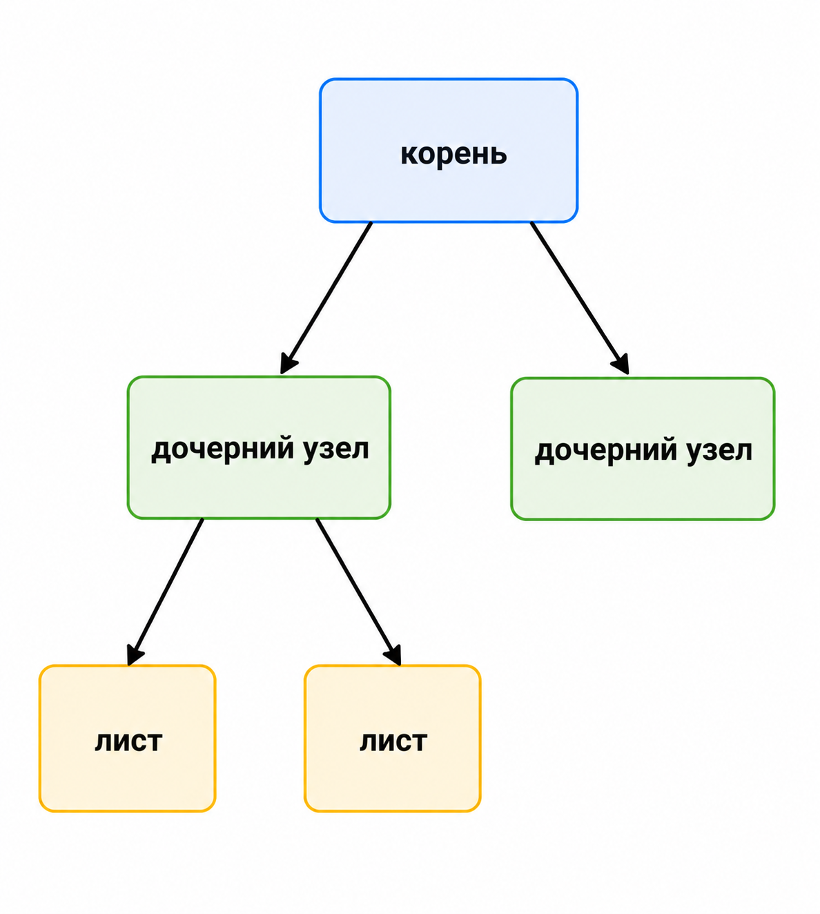

# Определение дерева, дерева с корнем. Высота дерева, родительские, дочерние узлы, листья. Количество рёбер

## Что такое дерево

Дерево — это связный граф без циклов.

Из этого определения сразу следуют важные свойства:

- между любыми двумя вершинами существует ровно один простой путь;
- если в дереве `n` вершин, то в нём ровно `n - 1` рёбер.

## Дерево с корнем

Если в дереве выбрана специальная вершина — **корень**, то дерево становится
ориентированным по уровням сверху вниз.

Появляются отношения:

- родитель;
- потомок;
- предок;
- ребёнок;
- лист.

## Базовые термины

- **Родитель** вершины `v` — вершина, из которой мы пришли в `v`.
- **Дочерние узлы** — вершины, для которых `v` является родителем.
- **Лист** — вершина без детей.
- **Внутренняя вершина** — вершина, у которой есть хотя бы один ребёнок.
- **Поддерево** вершины — сама вершина и все её потомки.

## Высота дерева

Высота — это длина самого длинного пути от корня до листа.

Чем больше высота, тем потенциально медленнее многие операции в древовидных
структурах.

## Почему число рёбер равно `n - 1`

Интуиция простая: каждая новая вершина подключается одним ребром. Чтобы связать
`n` вершин без циклов, нужно ровно `n - 1` соединений.

## Что важно запомнить

Почти все структуры из этого раздела — это разные варианты деревьев, в которых
мы специально поддерживаем полезные инварианты: порядок, балансировку, высоту и
так далее.

