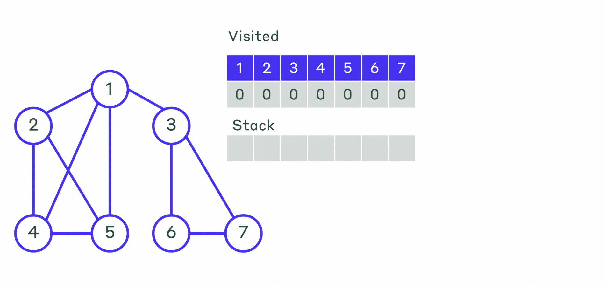
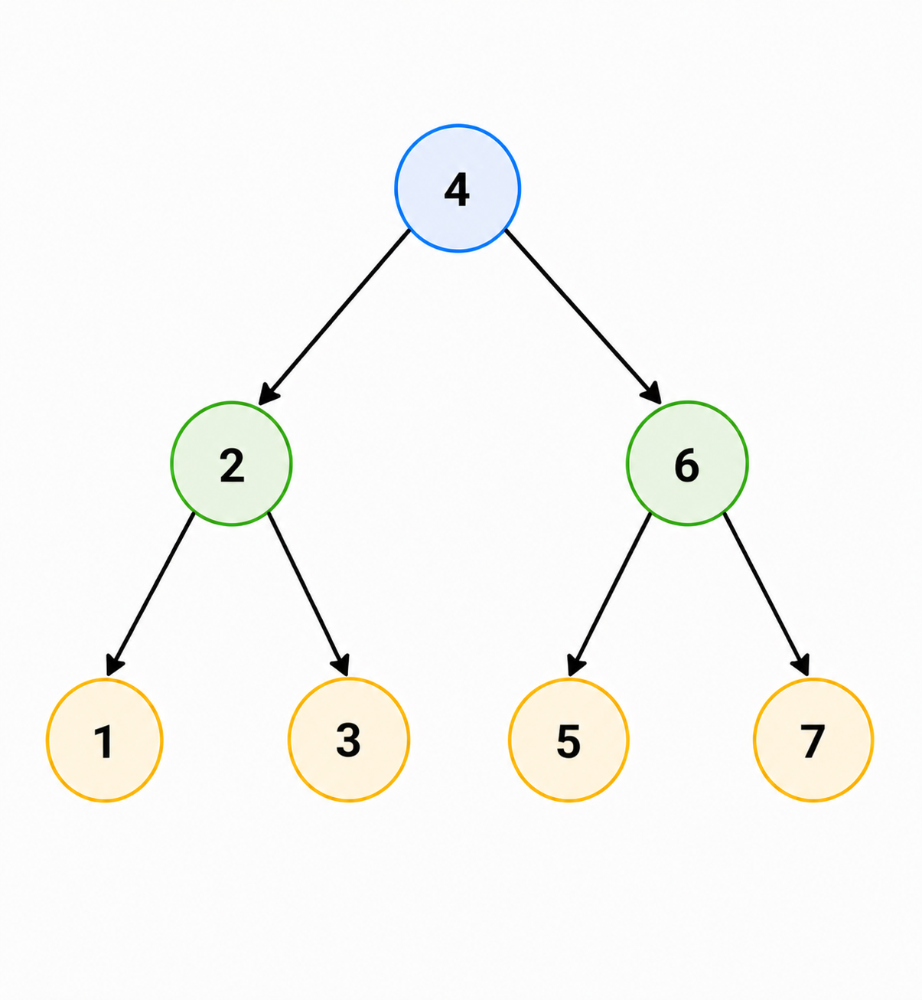

# Обходы в глубину. Pre-order, post-order и in-order для бинарных деревьев

## Что такое DFS-обход

Обход в глубину (`DFS`) означает: из вершины стараемся уйти как можно глубже,
а потом откатываемся назад.

Для бинарного дерева есть три классических порядка обхода.

### Визуализация 




## 1. Pre-order

Порядок:

1. вершина;
2. левое поддерево;
3. правое поддерево.

Используется, когда нужно сначала обработать корень, а потом потомков.

## 2. In-order

Порядок:

1. левое поддерево;
2. вершина;
3. правое поддерево.

Для бинарного дерева поиска этот обход выдаёт ключи в отсортированном порядке.

## 3. Post-order

Порядок:

1. левое поддерево;
2. правое поддерево;
3. вершина.

Полезен, когда нужно сначала обработать детей, а потом родителя.

## Пример



Для этого дерева:

- `pre-order`: `4 2 1 3 6 5 7`
- `in-order`: `1 2 3 4 5 6 7`
- `post-order`: `1 3 2 5 7 6 4`

## Реализация на C++

```cpp
struct Node {
  int key;
  Node* left = nullptr;
  Node* right = nullptr;
};

void PreOrder(Node* root) {
  if (root == nullptr) {
    return;
  }
  std::cout << root->key << ' ';
  PreOrder(root->left);
  PreOrder(root->right);
}

void InOrder(Node* root) {
  if (root == nullptr) {
    return;
  }
  InOrder(root->left);
  std::cout << root->key << ' ';
  InOrder(root->right);
}

void PostOrder(Node* root) {
  if (root == nullptr) {
    return;
  }
  PostOrder(root->left);
  PostOrder(root->right);
  std::cout << root->key << ' ';
}
```

## Что важно запомнить

Разные обходы — это не разные деревья, а разные способы линейно перечислить те
же самые вершины, подчёркивая разные свойства структуры.
