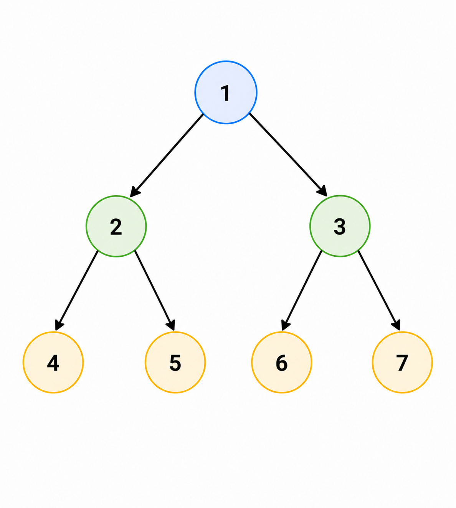

# Обход в ширину

## Идея BFS

Обход в ширину (`BFS`) идёт по уровням:

1. сначала корень;
2. затем все вершины первого уровня;
3. затем второго;
4. и так далее.

## Какая структура данных нужна

Для `BFS` используется очередь.

Почему именно очередь:

- вершины должны обрабатываться в порядке добавления;
- сначала приходят соседи текущего уровня, потом их дети.

## Пошаговая схема

1. кладём корень в очередь;
2. пока очередь не пуста:
   - достаём вершину из головы;
   - обрабатываем её;
   - добавляем её детей в конец очереди.

### Визуализация


## Что даёт BFS

- уровни дерева;
- расстояния от корня в невзвешенном графе;
- поуровневую обработку структуры.

## Пример

Для дерева:



обход в ширину даст:

```text
1 2 3 4 5 6 7
```

## Реализация на C++

```cpp
struct Node {
  int key;
  Node* left = nullptr;
  Node* right = nullptr;
};

void BreadthFirstSearch(Node* root) {
  if (root == nullptr) {
    return;
  }

  std::queue<Node*> q;
  q.push(root);

  while (!q.empty()) {
    Node* v = q.front();
    q.pop();

    std::cout << v->key << ' ';

    if (v->left != nullptr) {
      q.push(v->left);
    }
    if (v->right != nullptr) {
      q.push(v->right);
    }
  }
}
```

## Что важно запомнить

Если `DFS` идёт в глубину, то `BFS` идёт по слоям. Это две базовые стратегии,
которые потом встречаются во всём курсе.
