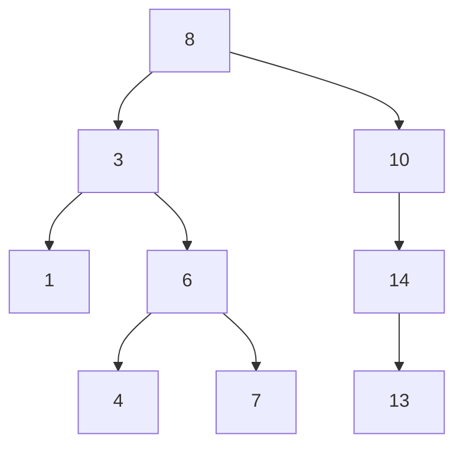

# Дерево поиска

## 1. Что такое бинарное дерево поиска

Бинарное дерево поиска (`BST`, binary search tree) — это бинарное дерево, в
котором для каждой вершины с ключом `x` выполняется инвариант:

- все ключи в левом поддереве меньше `x`;
- все ключи в правом поддереве больше `x`.

Если в задаче разрешены дубликаты, нужно отдельно договориться, куда именно они
кладутся:

- либо всегда влево;
- либо всегда вправо;
- либо в вершине хранится счётчик количества одинаковых ключей.

Самое главное здесь не конкретная конвенция, а то, что она должна быть
**единообразной**.

---

## 2. Почему это именно дерево поиска

Когда мы стоим в вершине и сравниваем искомый ключ `k` с ключом вершины `x`,
происходит очень сильное сокращение пространства поиска:

- если `k < x`, правое поддерево можно отбросить целиком;
- если `k > x`, левое поддерево можно отбросить целиком;
- если `k = x`, поиск завершён.

То есть каждое сравнение не просто “двигает нас дальше”, а уничтожает целую
группу кандидатов.

Именно поэтому `BST` концептуально очень близок к бинарному поиску.

---

## 3. Интуитивная связь с бинарным поиском по массиву

Полезно смотреть на `BST` как на **динамический аналог бинарного поиска**.

### В отсортированном массиве

- порядок уже есть;
- бинарный поиск работает быстро;
- но вставка и удаление дорогие, потому что элементы надо сдвигать.

### В дереве поиска

- порядок тоже есть;
- поиск идёт по сравнению ключей;
- вставка и удаление часто удобнее, потому что меняются только ссылки.

То есть массив и `BST` решают похожую задачу хранения упорядоченных данных, но
с разными инженерными компромиссами.

---

## 4. Пример структуры



Здесь легко проверить инвариант:

- у `8` слева только ключи `< 8`, справа только `> 8`;
- у `3` слева `1`, справа `6`;
- у `6` слева `4`, справа `7`;
- и так далее.

Очень важно, что инвариант должен выполняться **рекурсивно для всех вершин**, а
не только для корня.

---

## 5. Локальный и глобальный смысл инварианта

Частая ошибка новичка: думать, что достаточно сравнивать вершину только с её
непосредственными детьми.

Это неверно.

Например, в таком дереве:

```text
    8
   /
  3
   \
    9
```

у вершины `3` правый ребёнок `9` больше `3`, то есть локально всё выглядит
нормально. Но глобально это уже не `BST`, потому что `9` находится в левом
поддереве вершины `8`, а значит должен быть меньше `8`.

Поэтому инвариант `BST` — это **глобальное ограничение на целое поддерево**.

---

## 6. Самое важное свойство: in-order обход

Если сделать `in-order` обход:

1. левое поддерево;
2. текущая вершина;
3. правое поддерево,

то ключи выйдут в отсортированном порядке.

Это фундаментальный мост между:

- структурой дерева;
- и привычным линейным порядком чисел.

### Почему это правда

Потому что:

- всё левое поддерево меньше вершины;
- всё правое больше вершины;
- а внутри каждого поддерева порядок уже поддерживается тем же правилом
  рекурсивно.

То есть `BST` не просто хранит элементы, а хранит **сам отсортированный порядок
в своей форме**.

---

## 7. Что умеет BST как контейнер

`BST` интересен не только операцией “найти элемент”.

Он естественно поддерживает:

- `find(k)` — поиск ключа;
- `insert(k)` — вставку;
- `erase(k)` — удаление;
- `next(k)` — следующий по порядку элемент;
- `prev(k)` — предыдущий элемент;
- `min()` и `max()`;
- обход по возрастанию;
- запросы на диапазоны.

Именно это делает деревья поиска гораздо богаче, чем просто “структуру для
булевого ответа есть/нет”.

---

## 8. Минимум и максимум

В `BST`:

- минимум — это самая левая вершина;
- максимум — самая правая.

Почему:

- все меньшие элементы уходят влево;
- все большие — вправо.

Значит:

- чтобы взять минимум, нужно идти только по левым рёбрам;
- чтобы взять максимум — только по правым.

Сложность таких операций зависит от высоты дерева.

---

## 9. Почему скорость зависит от высоты

Все основные операции в `BST` идут по одному пути от корня вниз.

Если высота дерева равна `h`, то:

- поиск стоит `O(h)`;
- вставка стоит `O(h)`;
- удаление стоит `O(h)`;
- поиск минимума и максимума тоже `O(h)`.

Если дерево “похоже на логарифмическое”, то:

```text
h = O(log n)
```

и всё хорошо.

Если дерево выродилось в цепочку, то:

```text
h = O(n)
```

и все операции деградируют почти до работы со списком.

---

## 10. Где именно скрыта слабость BST

Основная проблема не в логике поиска как таковой. Она очень красива.

Слабость `BST` в том, что он **не контролирует форму дерева**.

Если ключи приходят в неудачном порядке, дерево может стать перекошенным.

Пример:

```text
1, 2, 3, 4, 5
```

даёт дерево вида:

```text
1
 \
  2
   \
    3
     \
      4
       \
        5
```

Это уже почти связный список.

---

## 11. Почему плохой порядок вставки опасен

В обычном `BST` структура определяется **историей поступления ключей**.

То есть два набора одинаковых чисел, вставленные в разном порядке, могут дать
совершенно разную форму дерева:

- одно — почти идеальное;
- другое — почти линейное.

Это делает производительность хрупкой.

Именно отсюда рождается вся следующая тема курса:

- AVL;
- red-black;
- treap;
- splay.

Все они пытаются сохранить достоинства `BST`, но сделать форму дерева
устойчивой.

---

## 12. Сравнение с другими представлениями порядка

| Структура | Поиск | Вставка | Удаление | Порядок |
|---|---|---|---|---|
| Неотсортированный массив | `O(n)` | `O(1)` в конец | `O(n)` | нет |
| Отсортированный массив | `O(log n)` | `O(n)` | `O(n)` | да |
| BST | `O(h)` | `O(h)` | `O(h)` | да |

Здесь хорошо видно, почему `BST` вообще появился:

он пытается совместить:

- порядок;
- быстрый поиск;
- более естественные модификации.

---

## 13. Где BST особенно силён

`BST` хорош, когда нам нужно:

- хранить множество ключей в порядке;
- уметь и искать, и вставлять, и удалять;
- делать обход по возрастанию;
- отвечать на запросы вида “ближайший слева/справа”.

То есть `BST` — это не “медленная альтернатива хеш-таблице”, а структура для
**упорядоченных** данных.

---

## 14. Чего BST не гарантирует

Обычное дерево поиска **не обещает**:

- логарифмическую высоту;
- устойчивую производительность на любом порядке вставки;
- хороший худший случай без дополнительных механизмов.

Поэтому, если нам нужны жёсткие гарантии, приходится использовать
самобалансирующиеся версии.

---

## 15. Ментальная модель, которую важно вынести

Правильный образ `BST` такой:

> Это отсортированное множество, представленное не массивом, а деревом, где
> сама структура кодирует отношение порядка.

Из этого почти автоматически следуют:

- поиск;
- вставка;
- удаление;
- in-order обход.

---

## 16. Что важно запомнить

`BST` — это базовая форма всех деревьев поиска в теме.

Нужно очень чётко понимать четыре вещи:

1. глобальный инвариант порядка по поддеревьям;
2. связь с бинарным поиском;
3. связь `in-order` обхода с отсортированным выводом;
4. зависимость всех оценок от высоты дерева.

Если эти четыре идеи ясны, то все сбалансированные деревья дальше читаются как
разные способы ответить на вопрос:

> как сохранить красоту `BST`, но не дать дереву выродиться?
