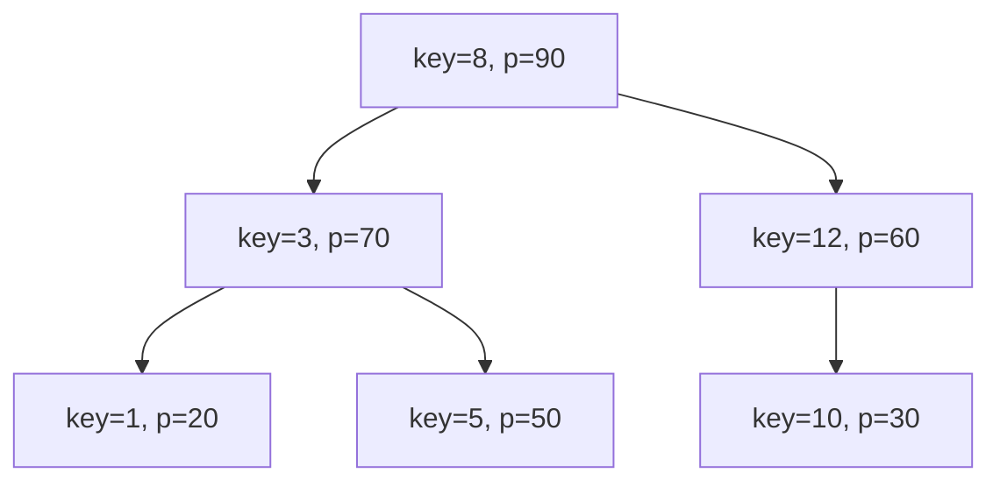

# Декартово дерево. Оценка средней высоты декартового дерева при случайных приоритетах

## 1. Почему декартово дерево особенно важно в курсе

`Treap` ценен не только как ещё одно сбалансированное дерево, а как очень
красивый пример объединения двух уже знакомых идей:

- `BST` по ключам;
- кучи по приоритетам.

Эта структура показывает важную мысль курса:

> балансировку можно получить не только жёсткими локальными ограничениями, но и
> случайностью.

---

## 2. Что такое декартово дерево

В каждой вершине хранятся:

- `key` — ключ поиска;
- `priority` — приоритет.

Структура одновременно удовлетворяет двум инвариантам:

1. По `key` это бинарное дерево поиска.
2. По `priority` это куча.

Если говорим про `max-heap` по приоритетам, то:

- приоритет вершины не меньше приоритетов её детей.

Если используется `min-heap`, все формулировки просто симметрично меняются.

---

## 3. Почему это вообще возможно

На первый взгляд может показаться, что два порядка одновременно — это слишком
жёстко. Но здесь они работают по разным координатам:

- `key` отвечает за горизонтальное расположение: кто слева, кто справа;
- `priority` отвечает за вертикальное: кто выше, кто ниже.

То есть:

- по ключам дерево выглядит как упорядоченное множество;
- по приоритетам — как иерархия важности.

Именно поэтому структура и называется декартовой: её удобно представлять как
набор точек `(key, priority)`.

---

## 4. Геометрическая интуиция

Если вершину представлять точкой:

- `x = key`;
- `y = priority`,

то:

- порядок по `x` задаёт in-order порядок;
- лучший `priority` поднимает вершину выше в дереве.

То есть дерево как будто строится из двухмерной информации:

- слева-справа;
- выше-ниже.

Это очень полезный образ, потому что он сразу объясняет, почему treap выглядит
логичным, а не искусственным.

---

## 5. Визуальный пример



Здесь:

- по ключам структура ведёт себя как `BST`;
- по приоритетам каждый родитель лучше детей.

Нужно видеть оба инварианта одновременно. Это центральная привычка для всей
темы treap.

---

## 6. Что в treap отвечает за поиск, а что — за форму

Это одна из самых важных мыслей:

- `key` нужен для поиска;
- `priority` нужен для баланса формы.

То есть приоритеты не участвуют в “семантике” множества как ключи, но именно
они определяют, кто станет предком, а кто потомком.

Из-за этого treap удобно воспринимать как:

> случайно сбалансированное дерево поиска.

---

## 7. Почему случайные приоритеты помогают

Если приоритеты выбираются случайно и независимо, то вершины получают случайный
“рейтинг важности”.

Это ведёт к очень важному эффекту:

- порядок ключей фиксирован данными;
- а форма дерева определяется случайным порядком приоритетов.

В среднем это делает дерево похожим на `BST`, построенное при случайном порядке
вставки.

А для случайного `BST` известно, что высота обычно логарифмическая.

---

## 8. Что означает “средняя высота”

Когда говорят:

```text
expected height = O(log n)
```

это не означает:

- что высота всегда ровно логарифмическая;
- или что худший случай невозможен.

Это означает, что **математическое ожидание** высоты по случайным приоритетам
растёт как `log n`.

То есть:

- плохие формы теоретически возможны;
- но для случайных приоритетов они маловероятны.

---

## 9. Почему плохая форма маловероятна

Чтобы дерево стало длинной цепочкой, нужно, чтобы приоритеты выстроились крайне
неудачно по отношению к ключам.

Интуитивно:

- для длинного плохого пути нужно, чтобы подряд много вершин оказались
  предками друг друга в очень неудачном порядке;
- вероятность такой согласованной неудачи быстро падает.

Поэтому treap и считается случайно сбалансированным.

---

## 10. Как правильно понимать “среднее O(log n)”

Есть два уровня понимания:

### Инженерный

На практике дерево обычно невысокое и операции быстрые.

### Теоретический

Случайные приоритеты моделируют случайную форму дерева, и высота получается
логарифмической в среднем.

Важно не путать:

- “всегда гарантировано” — это про AVL и red-black;
- “в среднем очень хорошо” — это про treap.

---

## 11. Сильные стороны treap

### Простая идея

Инварианты очень компактны:

- `BST` по ключам;
- куча по приоритетам.

### Хорошие средние оценки

Поиск, вставка, удаление, `split`, `merge` — в среднем `O(log n)`.

### Очень красивая алгебра операций

Treap особенно хорош там, где удобно мыслить разрезанием и склейкой деревьев.

### Удобство для диапазонных задач

Именно treap часто используется в задачах, где нужно работать с кусками
упорядоченного множества или последовательности.

---

## 12. Слабые стороны treap

### Нет жёсткой худшей гарантии

Если нужны именно worst-case гарантии, treap менее строг, чем AVL и red-black.

### Зависимость от качества случайности

Если приоритеты плохие или вовсе не случайные, структура может вести себя хуже.

### Труднее объяснять тем, кто привык к “детерминированной” балансировке

Для некоторых людей идея “баланс достигается случайностью” сначала кажется
психологически менее надёжной, хотя математически она вполне сильна.

---

## 13. Сравнение с AVL и red-black

| Структура | Источник баланса | Гарантия | Типичная сложность реализации |
|---|---|---|---|
| AVL | строгий контроль высот | худший случай `O(log n)` | средняя |
| Red-black | цветовые инварианты | худший случай `O(log n)` | выше средней |
| Treap | случайные приоритеты | среднее `O(log n)` | часто проще всех |

Эта таблица показывает очень важную мысль:

treap — не “плохой AVL”, а просто дерево с другой философией баланса.

---

## 14. Где treap особенно уместен

- олимпиадное программирование;
- учебные реализации;
- задачи с `split/merge`;
- неявные декартовы деревья для последовательностей;
- range-операции и order-statistics расширения.

---

## 15. Где treap может быть не лучшим выбором

- когда нужна строгая worst-case гарантия;
- когда нельзя использовать случайность;
- когда структура должна быть максимально стандартной и детерминированной.

---

## 16. Что важно запомнить

Treap нужно понимать на уровне трёх идей:

1. это `BST` по ключам;
2. это куча по приоритетам;
3. случайные приоритеты обычно дают логарифмическую высоту в среднем.

Если эта тройка интуитивно ясна, то все операции дальше выглядят почти
естественно.
