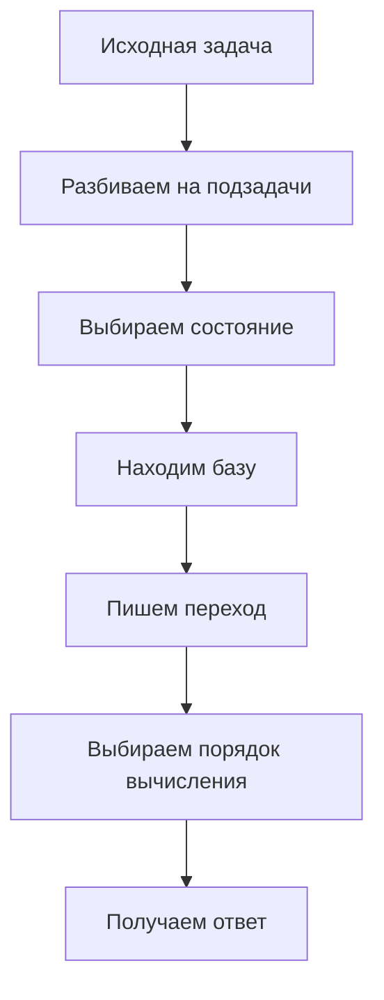

# Составляющие ДП: формула пересчёта, порядок, база, где лежит ответ

## 1. Что такое динамическое программирование на самом деле

Динамическое программирование (`dynamic programming`, `DP`) — это не “какая-то
магическая таблица”, а способ организовать вычисления так, чтобы:

- не пересчитывать одинаковые подзадачи много раз;
- аккуратно зафиксировать, **что именно мы уже знаем**;
- выразить сложный ответ через более простые ответы;
- выбрать порядок вычислений, в котором зависимость не ломается.

Очень важно понимать: `DP` — это не одна конкретная техника, а **семейство
подходов**. Иногда динамика выглядит как одномерный массив `dp[i]`, иногда как
матрица `dp[i][j]`, иногда как динамика по подмножествам, по маскам, по
вершинам графа, по длине пути, по состояниям автомата и так далее.

Общее у всех этих задач одно:

> большая задача разбивается на множество пересекающихся подзадач, а ответ на
> каждую подзадачу сохраняется и потом переиспользуется.

## 2. Почему обычная рекурсия часто плоха

Рассмотрим числа Фибоначчи:

```text
F(n) = F(n-1) + F(n-2)
```

Наивная рекурсия выглядит естественно:

```text
F(6)
├─ F(5)
│  ├─ F(4)
│  │  ├─ F(3)
│  │  └─ F(2)
│  └─ F(3)
└─ F(4)
```

Проблема в том, что:

- `F(4)` считается несколько раз;
- `F(3)` считается несколько раз;
- `F(2)` считается много раз.

То есть дерево вызовов разрастается не потому, что задача очень сложная, а
потому, что алгоритм **бестолково повторяет одну и ту же работу**.

Именно здесь и появляется идея динамики:

- либо запоминать уже вычисленное (`memoization`);
- либо сразу считать состояния в правильном порядке (`bottom-up`).

## 3. Какие свойства обычно есть у задач на DP

Не каждая задача решается динамикой. Обычно у задач на `DP` есть два ключевых
свойства.

### 3.1. Перекрывающиеся подзадачи

Это значит, что при разложении большой задачи возникают одинаковые подзадачи.

Пример:

- в Фибоначчи `F(4)` возникает из `F(6)` и из `F(5)`;
- в задаче о путях по сетке одна и та же клетка может достигаться разными
  способами;
- в `LCS` одна и та же пара префиксов встречается в разных ветвях рассуждения.

### 3.2. Оптимальная подструктура

Это значит, что оптимальный ответ для большой задачи можно выразить через
оптимальные ответы для меньших задач.

Пример:

- если лучшая возрастающая подпоследовательность заканчивается в `a[i]`, то
  перед ней должна стоять лучшая допустимая подпоследовательность, заканчивающаяся
  раньше;
- если мы ищем максимум цветочков для клетки `(i, j)`, то в неё выгодно
  приходить из того из двух соседей, у которого максимум уже лучше.

Если хотя бы одно из этих свойств отсутствует, динамика может быть неудобна или
вообще не нужна.

## 4. Пять обязательных вопросов для любой динамики

Практически любую задачу на `DP` удобно разбирать по одному и тому же шаблону.
Если ты можешь ответить на эти вопросы, то решение почти готово.

### 4.1. Что такое состояние

Состояние — это описание подзадачи.

Оно должно отвечать на вопрос:

> какую именно маленькую задачу мы сейчас решаем?

Примеры:

- `dp[i]` — ответ для первых `i` элементов или для позиции `i`;
- `dp[i][j]` — ответ для префиксов длины `i` и `j`;
- `dp[i][w]` — ответ для первых `i` предметов и веса `w`;
- `dp[v][k]` — ответ для вершины `v` и длины пути `k`.

Хорошее состояние:

- полностью описывает подзадачу;
- не хранит лишнего;
- позволяет удобно выразить переход.

Плохое состояние:

- забывает важную информацию;
- хранит слишком много деталей;
- не даёт простой формулы пересчёта.

### 4.2. Какая база

База — это самые простые состояния, для которых ответ известен сразу.

Примеры:

- `dp[0] = 1`, если в точку 0 есть ровно один способ “оказаться” — уже быть там;
- `dp[0][j] = 0`, если одна из строк пуста и `LCS` с ней имеет длину 0;
- `dp[0][0] = 0`, если пустой рюкзак и нулевая вместимость дают нулевую
  стоимость.

Почти любая ошибка в динамике — это один из трёх случаев:

- неверное состояние;
- неверный переход;
- забытая или плохо выставленная база.

### 4.3. Какая формула пересчёта

Это сердце всей динамики.

Именно здесь мы отвечаем на вопрос:

> как получить ответ для текущего состояния из уже известных состояний?

Примеры:

```text
dp[i] = dp[i-1] + dp[i-2]
```

```text
dp[i][j] = max(dp[i-1][j], dp[i][j-1]) + c[i][j]
```

```text
dp[i][w] = max(dp[i-1][w], dp[i-1][w-weight[i]] + cost[i])
```

Когда переход сложный, полезно отдельно выписать:

- какие действия возможны;
- какие случаи взаимоисключающие;
- какому выбору соответствует каждый член формулы.

### 4.4. В каком порядке считать

Даже идеальная формула бесполезна, если мы пытаемся вычислить состояние раньше,
чем готовы его зависимости.

Поэтому нужно понять:

- слева направо или справа налево;
- сверху вниз или снизу вверх;
- по длине от меньших к большим;
- по маске в порядке возрастания числа битов;
- по топологическому порядку графа.

Порядок вычислений — это фактически способ “разворачивания зависимостей”.

### 4.5. Где лежит итоговый ответ

Очень частая ошибка новичков:

> они правильно посчитали таблицу, но взяли ответ не из той ячейки.

Ответ может лежать:

- в `dp[n]`;
- в `dp[n][m]`;
- в `max(dp[i])`;
- в сумме нескольких состояний;
- в минимуме по последнему слою состояний.

Нужно всегда отдельно проговаривать:

> какое именно состояние соответствует исходной задаче?

## 5. Bottom-up и top-down: два стиля одной и той же идеи

### 5.1. Bottom-up

Это классический табличный стиль:

- начинаем с базы;
- последовательно строим все нужные состояния;
- приходим к ответу.

Плюсы:

- предсказуемый порядок;
- хорошо контролируется память;
- нет проблем с глубокой рекурсией;
- обычно быстрее на практике.

Минусы:

- иногда приходится считать много состояний, которые на самом деле не нужны;
- нужно заранее понять правильный порядок.

### 5.2. Top-down (мемоизация)

Это рекурсия с кэшем:

- вызываем функцию для ответа на исходную задачу;
- она рекурсивно требует более маленькие ответы;
- уже вычисленные состояния сохраняются.

Плюсы:

- решение часто ближе к математической формуле;
- считаются только те состояния, до которых реально дошли;
- бывает проще писать для сложных зависимостей.

Минусы:

- есть накладные расходы на рекурсию;
- можно упереться в глубину стека;
- иногда сложнее контролировать производительность.

### 5.3. Что выбрать на практике

Если задача учебная или структура перехода простая, часто удобнее `bottom-up`.
Если задача описывается естественной рекурсией и состояний потенциально много, а
достижимых мало, удобен `top-down`.

Важно понимать:

> это не две разные математики, а два способа организовать вычисление одной и
> той же динамики.

## 6. Как правильно выбирать состояние

Выбор состояния — это самая тонкая часть задачи.

### 6.1. Состояние должно быть достаточным

Оно должно хранить всё, что влияет на будущее.

Плохой пример:

- в задаче о последовательности хранить только длину, если на будущее влияет ещё
  и последний выбранный элемент.

Хороший пример:

- `dp[i]` как длина лучшей возрастающей подпоследовательности, оканчивающейся в
  `i`, потому что именно конец цепочки влияет на возможность продолжения.

### 6.2. Состояние не должно быть избыточным

Если хранить лишнее, размер таблицы может резко вырасти.

Например:

- иногда вместо `dp[i][sum][last]` можно хранить только `dp[i][sum]`;
- иногда вместо координат полного пути нужен только текущий индекс и остаток.

### 6.3. Состояние должно естественно выражать переход

Если ты не можешь красиво написать переход, это тревожный сигнал, что состояние
выбрано неудачно.

Очень полезный практический критерий:

> хорошее состояние делает формулу почти неизбежной.

## 7. Какие бывают типы динамики

### 7.1. Одномерная

Примеры:

- Фибоначчи;
- кузнечик;
- минимальная стоимость дойти до позиции;
- `LIS` в базовой версии.

### 7.2. Двумерная

Примеры:

- черепаха на сетке;
- `LCS`;
- рюкзак `dp[i][w]`.

### 7.3. Динамика по значениям

Иногда важна не позиция, а значение.

Пример:

- `LIS` через дерево Фенвика или дерево отрезков.

### 7.4. Динамика по графу

Примеры:

- число путей;
- кратчайшие пути в специальных постановках;
- пути длины ровно `k`.

### 7.5. Динамика по подмножествам

Это более продвинутый класс задач:

- `dp[mask]`;
- `dp[mask][v]`.

Такие задачи появляются, например, в коммивояжёре и задачах на перебор
подмножеств.

## 8. Как распознать задачу на DP

Есть несколько сильных сигналов.

### 8.1. В условии просят

- максимум;
- минимум;
- количество способов;
- факт достижимости.

### 8.2. Решение строится из меньших кусочков

Если ответ для большой задачи можно собирать из ответов для меньших кусков, это
очень хороший знак.

### 8.3. Наивная рекурсия дублирует вычисления

Если дерево рекурсии повторяет одинаковые ветви — почти наверняка это кандидат
на динамику.

### 8.4. У задачи есть “ось прогресса”

Например:

- номер позиции;
- длина префикса;
- число использованных предметов;
- число совершённых шагов;
- размер маски.

Это часто подсказывает форму состояния.

## 9. Как не путать DP с greedy

Обе темы часто решают задачи “на максимум” или “на минимум”, но их интуиция
разная.

Жадный алгоритм говорит:

> на каждом шаге сделаем локально лучший выбор.

Динамика говорит:

> рассмотрим все значимые состояния и аккуратно запомним лучший ответ для
> каждого из них.

Если локально хороший выбор может испортить глобальный оптимум, greedy опасен.
Если задача естественно разваливается на состояния и переходы, обычно нужна
динамика.

## 10. Как не путать DP с полным перебором

Полный перебор:

- просто перечисляет варианты;
- часто пересчитывает похожие случаи заново.

Динамика:

- группирует варианты по состояниям;
- использует тот факт, что многим вариантам соответствует одна и та же
  подзадача.

Можно сказать так:

> DP — это перебор, который стал умнее и научился не забывать уже сделанную
> работу.

## 11. Типичные ошибки в задачах на динамику

### 11.1. Неправильная база

Например:

- забыли `dp[0]`;
- перепутали пустую строку и пустой путь;
- неверно обработали первый ряд/столбец таблицы.

### 11.2. Неверный смысл состояния

Очень частая ловушка — хранить “ответ для первых `i` элементов”, когда реально
нужен “ответ, оканчивающийся в `i`”.

### 11.3. Переход использует не те зависимости

Иногда формула выглядит правдоподобно, но логически она нарушает смысл задачи.

### 11.4. Неправильный порядок обхода

Например, обновили массив так, что новое значение начало влиять на расчёт того
же слоя, где должны использоваться только старые значения.

### 11.5. Неправильно сняли ответ

Особенно часто в:

- `LIS`;
- задачах на сетке;
- задачах на количество способов.

## 12. Оптимизация памяти

Не всегда нужно хранить всю таблицу.

Если переход использует только предыдущую строку или столбец, можно хранить:

- две строки;
- две колонки;
- даже один массив при аккуратном порядке обхода.

Примеры:

- Фибоначчи можно считать за `O(1)` памяти;
- `LCS` длину можно считать за `O(m)` памяти;
- рюкзак в некоторых вариантах сжимается из `O(nW)` до `O(W)`.

Но здесь важно не сломать зависимость:

- если нужен “предыдущий слой”, нельзя случайно затирать его раньше времени.

## 13. Мини-чеклист перед кодированием

Перед тем как писать код, полезно письменно ответить:

1. Что хранит состояние?
2. Что является базой?
3. Из каких состояний происходит переход?
4. В каком порядке всё вычисляется?
5. Где лежит итоговый ответ?
6. Можно ли сжать память?
7. Нужно ли восстанавливать не только значение, но и сам ответ?

Если на эти вопросы есть ясные ответы, код обычно пишется уже спокойно.

## 14. Главная ментальная модель

На динамику полезно смотреть так:



То есть `DP` — это не просто таблица. Это дисциплина проектирования решения:

- сначала понять, **какая информация нужна**;
- потом понять, **как эта информация эволюционирует**;
- и только после этого писать массив `dp`.

## 15. Что важно запомнить

Динамическое программирование почти всегда сводится к пяти главным опорам:

1. корректное состояние;
2. корректная база;
3. корректный переход;
4. корректный порядок вычисления;
5. корректное место, где читается ответ.

Если хотя бы одна из этих опор выбрана плохо, решение разваливается. Если все
пять выбраны правильно, то задача обычно уже почти решена.
