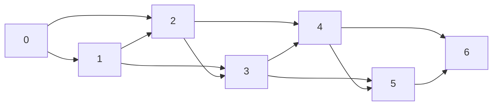

# Задача о кузнечике. Задача о черепахе

## 1. Почему именно эти задачи считаются базой для DP

Задачи про кузнечика и черепаху — это почти идеальный первый контакт с
динамическим программированием. В них ещё нет сложных структур данных, тонких
доказательств и громоздких состояний, но уже есть всё главное:

- состояние;
- база;
- переход;
- порядок вычисления;
- восстановление ответа;
- разные цели: количество, максимум, минимум, достижимость.

Именно поэтому эти задачи так важны: они учат **мышлению в состояниях**, а не
просто механическому заполнению массива.

## 2. Задача о кузнечике: самая простая линейная динамика

### 2.1. Базовая постановка

Кузнечик стоит в точке `0` и хочет попасть в точку `n`.
Пусть он может прыгать:

- на 1 клетку;
- на 2 клетки.

Нужно посчитать количество способов попасть в `n`.

### 2.2. Как думать о задаче

Вместо вопроса:

> сколько способов попасть в `n`?

лучше задавать вопрос:

> сколько способов попасть в любую конкретную точку `i`?

Так рождается состояние:

```text
dp[i] = количество способов попасть в точку i
```

### 2.3. Почему переход именно такой

В точку `i` можно прийти:

- из `i - 1` прыжком на 1;
- из `i - 2` прыжком на 2.

Других допустимых вариантов нет. Значит:

```text
dp[i] = dp[i-1] + dp[i-2]
```

Это очень важный момент: формула не “угадывается”, а рождается из полного
перечня последних действий.

### 2.4. База

Если считать, что кузнечик уже стоит в нуле, то:

```text
dp[0] = 1
```

Это означает: есть ровно один способ оказаться в точке 0 — ничего не делать.

Дальше:

```text
dp[1] = 1
```

Потому что в 1 можно попасть только одним прыжком на 1.

### 2.5. Пошаговый пример

Пусть `n = 6`.

Тогда:

```text
dp[0] = 1
dp[1] = 1
dp[2] = dp[1] + dp[0] = 2
dp[3] = dp[2] + dp[1] = 3
dp[4] = dp[3] + dp[2] = 5
dp[5] = dp[4] + dp[3] = 8
dp[6] = dp[5] + dp[4] = 13
```

Мы получили ту же рекурсию, что и у Фибоначчи.

### 2.6. Визуальная интерпретация



Количество путей до вершины — это и есть `dp[i]`.

## 3. Модификации задачи о кузнечике

Базовая версия важна не сама по себе, а как шаблон.

### 3.1. Прыжки на 1, 2 или 3 клетки

Тогда:

```text
dp[i] = dp[i-1] + dp[i-2] + dp[i-3]
```

### 3.2. Запрещённые клетки

Если на некоторые клетки вставать нельзя, то:

- для запрещённой клетки `dp[i] = 0`;
- переходы через неё автоматически перестанут давать вклад.

### 3.3. Минимальная стоимость пути

Если у каждой клетки есть цена, то состояние меняется:

```text
dp[i] = минимальная стоимость попасть в i
```

Тогда переход уже не суммирует способы, а берёт минимум:

```text
dp[i] = min(dp[i-1], dp[i-2]) + cost[i]
```

### 3.4. Максимальная прибыль

Если на каждой клетке лежит бонус:

```text
dp[i] = max(dp[i-1], dp[i-2]) + bonus[i]
```

Именно здесь очень хорошо видно, что геометрия задачи не меняется, а смысл
операции в переходе меняется радикально.

## 4. Почему кузнечик — это важнейший шаблон

Задача про кузнечика учит универсальной идее:

> если движение идёт по прямой оси времени или позиции, то часто достаточно
> одномерной динамики.

Этот шаблон потом всплывает в:

- разбиении строки;
- движении по лестнице;
- минимальной стоимости добраться до конца;
- количестве способов набрать сумму;
- линейных рекуррентных формулах.

## 5. Задача о черепахе: переход от одной оси к двум

### 5.1. Базовая постановка

Черепаха находится в левом верхнем углу таблицы и может ходить:

- только вправо;
- только вниз.

Это значит, что любая клетка `(i, j)` достигается только из:

- `(i - 1, j)`;
- `(i, j - 1)`.

То есть структура перехода почти та же, что у кузнечика, только теперь мы
живём не на прямой, а на сетке.

## 6. Черепаха: максимум собранных цветочков

### 6.1. Постановка

В каждой клетке `(i, j)` лежит `c[i][j]` цветочков. Нужно добраться из левого
верхнего угла в правый нижний и собрать максимум.

### 6.2. Состояние

```text
dp[i][j] = максимальное количество цветочков,
           которое можно собрать, попав в клетку (i, j)
```

### 6.3. Почему переход именно такой

В клетку `(i, j)` можно прийти только:

- сверху;
- слева.

Значит лучший путь в `(i, j)` — это лучший из этих двух путей плюс содержимое
текущей клетки:

```text
dp[i][j] = max(dp[i-1][j], dp[i][j-1]) + c[i][j]
```

### 6.4. База

Нужно аккуратно инициализировать:

- `dp[0][0] = c[0][0]`;
- первый ряд;
- первый столбец.

Потому что:

- в первый ряд можно попасть только слева;
- в первый столбец — только сверху.

### 6.5. Почему тут часто ошибаются

Новички часто:

- пишут общую формулу сразу для всех клеток;
- забывают, что у верхней строки нет клетки сверху;
- забывают, что у левого столбца нет клетки слева.

Поэтому край таблицы почти всегда требует отдельной обработки.

## 7. Черепаха: количество путей

Теперь пусть задача другая:

> сколько существует способов дойти до клетки `(i, j)`?

### 7.1. Состояние

```text
dp[i][j] = количество путей до клетки (i, j)
```

### 7.2. Переход

```text
dp[i][j] = dp[i-1][j] + dp[i][j-1]
```

Почему?

Потому что любой путь в `(i, j)` заканчивается:

- либо шагом вниз из `(i-1, j)`;
- либо шагом вправо из `(i, j-1)`.

### 7.3. База

Обычно:

```text
dp[0][0] = 1
```

И если все клетки проходимы, то:

- в любую клетку первого ряда есть ровно один путь;
- в любую клетку первого столбца тоже ровно один путь.

## 8. Черепаха с препятствиями

Если некоторые клетки заблокированы:

- в них нельзя входить;
- через них нельзя проводить маршруты.

Тогда правило очень простое:

```text
если клетка blocked:
    dp[i][j] = 0
иначе:
    dp[i][j] = dp[i-1][j] + dp[i][j-1]
```

Это один из самых полезных уроков раннего `DP`:

> ограничения часто не требуют новой математики — они просто меняют базу и
> допустимость переходов.

## 9. Черепаха на минимум

Можно искать не максимум и не количество, а минимум стоимости пути.

Если `w[i][j]` — цена входа в клетку, то:

```text
dp[i][j] = min(dp[i-1][j], dp[i][j-1]) + w[i][j]
```

Это та же геометрия, но другая операция в переходе.

## 10. Одна геометрия — много задач

Это очень важная мысль.

Одна и та же схема движения по сетке порождает разные динамики:

| Что ищем | Состояние | Переход |
|---|---|---|
| Количество путей | `dp[i][j]` | `+` |
| Максимум награды | `dp[i][j]` | `max + value` |
| Минимум стоимости | `dp[i][j]` | `min + cost` |
| Достижимость | `dp[i][j]` | `OR` |

То есть каркас задачи остаётся, а смысл арифметики меняется.

## 11. Восстановление оптимального пути

Если мы искали максимум или минимум, часто хочется восстановить не только
значение, но и сам маршрут.

Для этого можно:

- хранить `parent[i][j]`, откуда мы пришли;
- или восстанавливать путь, двигаясь назад по значениям `dp`.

Например, если:

```text
dp[i][j] = max(dp[i-1][j], dp[i][j-1]) + c[i][j]
```

то при движении назад:

- если `dp[i][j]` получено сверху, идём вверх;
- если слева — идём влево.

## 12. Сложность

Для таблицы `n x m`:

- время: `O(nm)`;
- память: `O(nm)`.

Но если нужен только ответ без восстановления пути, память иногда можно сжать
до `O(m)`, храня одну текущую строку.

## 13. Почему эти две задачи образуют единый учебный блок

Кузнечик и черепаха — это не две случайные задачи, а последовательная лестница:

1. сначала учимся динамике на одной оси;
2. потом переносим ту же логику на две оси;
3. потом меняем не геометрию, а цель задачи;
4. потом добавляем препятствия, стоимости, восстановление пути.

Именно после этого обычно становится понятно, что динамика — это не набор
частных формул, а очень общая техника проектирования решений.

## 14. Типичные ошибки

### В кузнечике

- забыть `dp[0] = 1`;
- неверно обработать маленькие `n`;
- перепутать “число способов” и “минимальную стоимость”.

### В черепахе

- сломать первый ряд и первый столбец;
- забыть обрабатывать стены;
- написать `max`, когда нужно `+`, или наоборот;
- не различать “стоимость клетки” и “стоимость перехода”.

## 15. Что важно запомнить

Кузнечик и черепаха — это фундамент всего `DP`.

Они учат трём главным вещам:

1. правильно выбирать состояние;
2. строить переход как разбор последнего шага;
3. понимать, что одна и та же структура задачи может решать разные цели:
   количество, минимум, максимум, достижимость.
