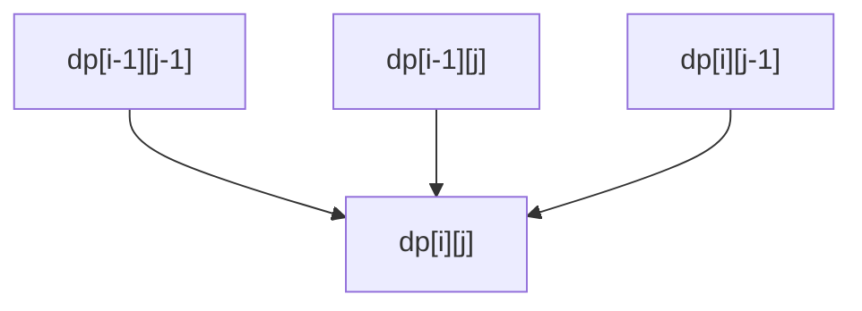

# Задача о наибольшей общей подпоследовательности

## 1. Что такое подпоследовательность и почему это не подстрока

Это очень важное различие, на котором многие спотыкаются.

### Подпоследовательность

Подпоследовательность получается удалением некоторых элементов без нарушения
порядка оставшихся.

Пример:

```text
abcdef -> acef
```

Это корректная подпоследовательность.

### Подстрока

Подстрока обязана быть непрерывным куском:

```text
abcdef -> cde
```

Поэтому:

- `ace` — подпоследовательность;
- `ace` — не подстрока.

Задача `LCS` работает именно с подпоследовательностями, а значит допускает
пропуски.

## 2. Постановка задачи

Даны две последовательности:

- строка;
- массив чисел;
- последовательность событий;
- вообще любой упорядоченный набор элементов.

Нужно найти длину их наибольшей общей подпоследовательности.

Иногда дополнительно нужно восстановить саму подпоследовательность.

## 3. Почему задача важна

`LCS` — одна из центральных задач двумерного динамического программирования.
Она важна не только сама по себе, но и как школа мышления:

- как работать с двумя осями сразу;
- как вводить ответ на префиксах;
- как сравнивать последние элементы;
- как потом восстанавливать сам объект, а не только численное значение.

Кроме того, `LCS` лежит в основе:

- алгоритмов сравнения текстов;
- diff-инструментов;
- биоинформатики;
- анализа последовательностей действий.

## 4. Наивная рекурсия и почему она плоха

Если думать рекурсивно, то для префиксов `x[0..i-1]` и `y[0..j-1]` можно
сказать:

- если последние символы равны, идём в диагональ;
- если не равны, пробуем отбросить символ из одной строки или из другой.

Рекурсия получается естественной, но быстро начинает дублировать подзадачи.
Одна и та же пара `(i, j)` может возникать много раз.

Именно поэтому `LCS` — очень хороший пример перекрывающихся подзадач.

## 5. Главная идея: ответ на префиксах

Пусть:

```text
dp[i][j] = длина LCS для префиксов:
           x[0..i-1] и y[0..j-1]
```

Это одна из самых красивых идей в динамике:

> вместо того чтобы сразу думать о всей строке, мы думаем о всех парах
> префиксов.

Почему префиксы удобны:

- если мы умеем решать задачу для меньших префиксов, то можем аккуратно
  наращивать размер;
- переходы “слева”, “сверху” и “по диагонали” становятся естественными.

## 6. Почему переход именно такой

Рассмотрим последние символы:

```text
x[i-1] и y[j-1]
```

### 6.1. Если символы равны

Тогда этот символ может стоять в конце общей подпоследовательности.
Всё, что было до него, должно быть лучшим ответом для меньших префиксов:

```text
dp[i][j] = dp[i-1][j-1] + 1
```

### 6.2. Если символы не равны

Тогда последние символы не могут одновременно завершать одну и ту же общую
подпоследовательность. Значит хотя бы один из них не используется в оптимальном
ответе.

Тогда есть два естественных варианта:

- отбросить `x[i-1]`;
- отбросить `y[j-1]`.

И взять лучший:

```text
dp[i][j] = max(dp[i-1][j], dp[i][j-1])
```

### 6.3. Почему не нужен `dp[i-1][j-1]` в случае несовпадения

Потому что:

- `dp[i-1][j] >= dp[i-1][j-1]`;
- `dp[i][j-1] >= dp[i-1][j-1]`.

То есть диагональ автоматически не лучше, чем один из соседей.

## 7. Геометрия таблицы

Таблица `dp` выглядит как решётка, где каждая клетка зависит от:

- клетки сверху;
- клетки слева;
- клетки по диагонали сверху-слева.



Если символы совпали, выбирается диагональ.
Если не совпали — максимум из верхней и левой клетки.

## 8. База

Если одна из строк пустая, общая подпоследовательность имеет длину 0:

```text
dp[0][j] = 0
dp[i][0] = 0
```

Это и есть нулевая строка и нулевой столбец таблицы.

Они не просто “технические”, а логически означают:

> у пустой последовательности нет непустой общей подпоследовательности ни с чем.

## 9. Пошаговый пример

Пусть:

```text
x = abcbdab
y = bdcaba
```

Мы заполняем таблицу по префиксам.

Когда видим совпадения:

- `a` с `a`,
- `b` с `b`,
- `c` с `c`,

то растём по диагонали.

Когда символы не совпадают, берём максимум из уже построенных ответов.

Важно не просто помнить формулу, а чувствовать интерпретацию:

- диагональ = “совпавший символ включён”;
- вверх/влево = “один из хвостов отбрасывается”.

## 10. Псевдокод

```cpp
std::vector<std::vector<int>> BuildLcsTable(
    const std::string& x,
    const std::string& y) {
  std::vector<std::vector<int>> dp(
      x.size() + 1, std::vector<int>(y.size() + 1, 0));

  for (size_t i = 1; i <= x.size(); ++i) {
    for (size_t j = 1; j <= y.size(); ++j) {
      if (x[i - 1] == y[j - 1]) {
        dp[i][j] = dp[i - 1][j - 1] + 1;
      } else {
        dp[i][j] = std::max(dp[i - 1][j], dp[i][j - 1]);
      }
    }
  }

  return dp;
}
```

## 11. Восстановление самой подпоследовательности

Одной длины часто недостаточно. Хочется получить сам ответ.

### 11.1. Идея восстановления

Начинаем из клетки:

```text
dp[n][m]
```

И двигаемся назад.

### 11.2. Правила

- если `x[i-1] == y[j-1]`, этот символ входит в ответ:
  - добавляем его;
  - идём по диагонали в `(i-1, j-1)`;
- иначе:
  - если `dp[i-1][j] >= dp[i][j-1]`, идём вверх;
  - иначе идём влево.

### 11.3. Почему ответ собирается в обратном порядке

Потому что мы идём от конца таблицы к началу. Значит найденные символы нужно
либо складывать в стек, либо потом развернуть.

## 12. Почему в `LCS` так хорошо видно смысл двумерной динамики

Одномерная динамика обычно спрашивает:

> что происходит к позиции `i`?

Двумерная динамика спрашивает:

> что происходит одновременно для первых `i` элементов одной структуры и первых
> `j` элементов другой?

`LCS` — это, возможно, самый чистый пример такого мышления.

## 13. Оптимизация памяти

Если нужна только длина, а не восстановление ответа, всю таблицу хранить не
обязательно.

Переход использует только:

- текущую строку;
- предыдущую строку.

Значит память можно уменьшить до:

```text
O(m)
```

если `m` — длина второй строки.

Но:

- восстановить саму подпоследовательность в таком режиме уже сложнее;
- придётся либо хранить дополнительную информацию, либо пересчитывать.

## 14. Сложность

Для строк длины `n` и `m`:

- время: `O(nm)`;
- память: `O(nm)` в полной таблице;
- память: `O(m)` в версии только для длины.

## 15. Где `LCS` встречается на практике

### 15.1. Сравнение текстов

Если два документа отличаются не очень сильно, `LCS` помогает понять, какие
фрагменты были сохранены в том же порядке.

### 15.2. Системы контроля версий и diff

В классических diff-задачах логика очень близка к поиску общей структуры между
двумя последовательностями строк или символов.

### 15.3. Биоинформатика

Сравнение генетических последовательностей — одна из исторически важных сфер
применения задач этого типа.

### 15.4. Анализ действий пользователя

Можно сравнивать сценарии событий и искать устойчивые общие шаблоны.

## 16. Чем `LCS` отличается от похожих задач

### 16.1. Не путать с longest common substring

В `longest common substring` совпадающий кусок обязан быть непрерывным.
В `LCS` можно пропускать символы.

### 16.2. Не путать с edit distance

`Edit distance` измеряет цену превращения одной строки в другую.
`LCS` ищет максимальную общую подпоследовательность.

Хотя эти задачи тесно связаны, формулы у них разные.

## 17. Типичные ошибки

- забыть нулевую строку и нулевой столбец;
- перепутать подпоследовательность с подстрокой;
- в случае несовпадения брать `dp[i-1][j-1]`, хотя это не нужно;
- восстанавливать ответ, двигаясь не по тем правилам;
- путать индексы строки и индексы таблицы.

## 18. Что важно запомнить

`LCS` — это эталонная двумерная динамика:

1. состояние строится на префиксах;
2. совпавшие символы дают диагональный переход;
3. несовпадение приводит к выбору между верхом и левым соседом;
4. таблица хранит не сам ответ, а длины лучших ответов для всех подзадач;
5. при желании из неё можно восстановить саму подпоследовательность.
