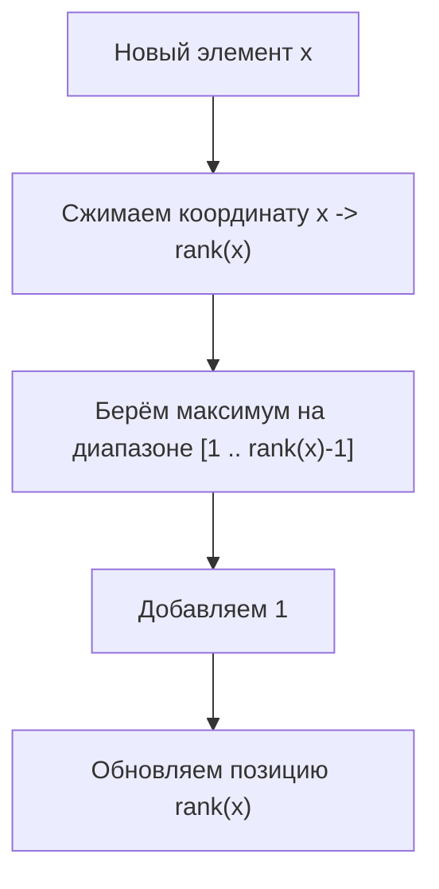

# Дерево отрезков для решения задачи о НВП

## 1. Как эта тема связана с `LIS`

Задача о наибольшей возрастающей подпоследовательности (`НВП`, `LIS`) обычно
сначала решается:

- либо за `O(n^2)` через классическую динамику;
- либо за `O(n log n)` через массив лучших хвостов и бинарный поиск.

Но есть ещё один очень важный взгляд:

> можно рассматривать `LIS` как задачу “быстро брать максимум по всем значениям,
> меньшим текущего”.

Этот взгляд особенно ценен, потому что он связывает динамическое
программирование со структурами данных:

- деревом отрезков;
- деревом Фенвика;
- offline- и coordinate-compression-техниками.

## 2. Какая именно задача здесь решается

Если формулировка звучит так:

> удалить минимальное число элементов, чтобы оставшаяся последовательность стала
> строго возрастающей,

то это эквивалентно задаче найти длину `LIS`.

Если массив длины `n`, а длина `LIS` равна `L`, то удалить нужно:

```text
n - L
```

Значит вся сложность прячется в эффективном вычислении `LIS`.

## 3. Классический переход для `LIS`

Напомним базовую формулу:

```text
dp[i] = 1 + max(dp[j]) по всем j < i, где a[j] < a[i]
```

Здесь `dp[i]` — длина лучшей возрастающей подпоследовательности, оканчивающейся
в `a[i]`.

Проблема в том, что прямой перебор всех `j` даёт `O(n^2)`.

## 4. Где здесь появляется запрос на максимум

Если смотреть на переход не по индексам, а по значениям, становится видно:

для элемента `a[i]` нам нужен:

```text
лучший ответ среди всех значений < a[i]
```

То есть по сути нам нужен запрос вида:

```text
max on prefix
```

Если мы умеем:

- быстро брать максимум по диапазону значений;
- быстро обновлять ответ для конкретного значения,

то можем получить `O(n log n)`.

## 5. Переход от динамики по индексам к динамике по значениям

Это принципиально важная идея.

Вместо:

```text
dp[i]
```

мы начинаем думать так:

```text
best[x] = лучшая длина возрастающей подпоследовательности,
          оканчивающейся значением x
```

Тогда для очередного `a[i] = x`:

1. запрашиваем максимум по всем значениям `< x`;
2. прибавляем 1;
3. обновляем позицию `x`.

То есть:

```text
cur = 1 + max(best[values < x])
best[x] = max(best[x], cur)
```

## 6. Почему это корректно

Если возрастающая подпоследовательность заканчивается значением `x`, то перед
ним может стоять только значение строго меньше `x`.

При этом нас уже не интересует, на каком индексе в массиве стоял этот
предыдущий элемент — мы обработали элементы слева направо, и все допустимые
предыдущие кандидаты уже учтены.

Значит достаточно знать:

> какой лучший результат уже достигался на всех меньших значениях.

И это как раз максимум на префиксе.

## 7. Роль дерева отрезков

Дерево отрезков — структура данных, которая умеет:

- быстро отвечать на запросы по диапазону;
- быстро обновлять отдельные позиции.

Для этой задачи нам нужен конкретный набор операций:

- `query(1, x - 1)` — максимум на префиксе значений;
- `update(x, cur)` — улучшить ответ для значения `x`.

Обе операции занимают:

```text
O(log m)
```

где `m` — число различных значений после сжатия координат.

## 8. Почему без сжатия координат обычно нельзя

Пусть значения массива огромные:

```text
-10^9 ... 10^9
```

Тогда строить дерево отрезков по всему числовому диапазону бессмысленно.

Но для `LIS` важен не абсолютный размер числа, а только порядок между числами.

Поэтому делаем **сжатие координат**.

## 9. Что такое сжатие координат

Идея:

1. собираем все значения массива;
2. сортируем их;
3. удаляем повторы;
4. каждому значению присваиваем ранг:

```text
минимальное значение -> 1
следующее -> 2
...
```

После этого:

- если `a < b`, то `rank(a) < rank(b)`;
- равные элементы получают одинаковый ранг;
- диапазон значений становится компактным.

## 10. Почему сжатие координат ничего не ломает

В `LIS` важны только сравнения:

```text
<, >, =
```

Сжатие сохраняет относительный порядок, а значит логика “можно ли продолжить
подпоследовательность” остаётся той же самой.

Это один из самых важных общих приёмов в алгоритмах:

> если важен порядок, а не сами числа, значения можно заменить рангами.

## 11. Пошаговая схема решения

Пусть после сжатия координат у нас есть массив рангов `b[i]`.

Тогда для каждого `b[i]`:

1. вычисляем:

```text
best_before = query(1, b[i] - 1)
```

2. получаем:

```text
cur = best_before + 1
```

3. обновляем:

```text
update(b[i], cur)
```

4. поддерживаем глобальный максимум.

## 12. Что хранится в вершинах дерева

В каждой вершине дерева отрезков хранится:

```text
максимальная длина LIS на соответствующем диапазоне значений
```

Например, если вершина покрывает значения `[5..8]`, то в ней лежит лучший
результат среди всех подпоследовательностей, оканчивающихся значениями из этого
диапазона.

## 13. Визуальная интуиция



То есть каждый новый элемент спрашивает:

> какой лучший хвост меньшего значения уже существует?

и потом строит продолжение этого ответа.

## 14. Реализация на C++

```cpp
class SegmentTree {
 public:
  explicit SegmentTree(int n) : tree_(4 * n, 0) {}

  int Query(int v, int tl, int tr, int l, int r) {
    if (l > r) {
      return 0;
    }
    if (l == tl && r == tr) {
      return tree_[v];
    }
    int tm = (tl + tr) / 2;
    return std::max(
        Query(v * 2, tl, tm, l, std::min(r, tm)),
        Query(v * 2 + 1, tm + 1, tr, std::max(l, tm + 1), r));
  }

  void Update(int v, int tl, int tr, int pos, int value) {
    if (tl == tr) {
      tree_[v] = std::max(tree_[v], value);
      return;
    }
    int tm = (tl + tr) / 2;
    if (pos <= tm) {
      Update(v * 2, tl, tm, pos, value);
    } else {
      Update(v * 2 + 1, tm + 1, tr, pos, value);
    }
    tree_[v] = std::max(tree_[v * 2], tree_[v * 2 + 1]);
  }

 private:
  std::vector<int> tree_;
};

int GetLisLengthWithSegmentTree(const std::vector<int>& a) {
  std::vector<int> values = a;
  std::sort(values.begin(), values.end());
  values.erase(std::unique(values.begin(), values.end()), values.end());

  auto get_rank = [&](int x) {
    return static_cast<int>(
        std::lower_bound(values.begin(), values.end(), x) - values.begin()) + 1;
  };

  int m = static_cast<int>(values.size());
  SegmentTree st(m);
  int answer = 0;

  for (int x : a) {
    int pos = get_rank(x);
    int best_before = st.Query(1, 1, m, 1, pos - 1);
    int cur = best_before + 1;
    st.Update(1, 1, m, pos, cur);
    answer = std::max(answer, cur);
  }

  return answer;
}
```

## 15. Сложность

Пусть `n` — длина массива, `m` — число различных значений.

Тогда:

- сжатие координат: `O(n log n)`;
- для каждого элемента:
  - запрос: `O(log m)`;
  - обновление: `O(log m)`.

Итог:

```text
O(n log n)
```

Память:

```text
O(m)
```

## 16. Почему здесь можно использовать и дерево Фенвика

Если операция — максимум на префиксе, дерево Фенвика тоже может подойти.

С точки зрения идеи задачи разницы почти нет:

- и там, и там мы поддерживаем лучшие ответы по значениям;
- и там, и там делаем запрос “лучший ответ для всех меньших”.

Разница в основном инженерная:

- Fenwick компактнее;
- segment tree универсальнее.

## 17. Чем это решение отличается от “лучших хвостов”

Есть два разных `O(n log n)`-подхода:

### Подход 1. Массив хвостов + бинарный поиск

- очень элегантен;
- отлично даёт длину;
- менее прямолинеен для некоторых модификаций.

### Подход 2. Структура данных по значениям

- ближе к обычной динамике;
- легче обобщается, когда нужно не только длину, но и, например, число лучших
  вариантов, максимум веса, дополнительные ограничения;
- показывает глубокую связь `DP` и range-query структур.

## 18. Когда такой взгляд особенно полезен

Этот подход очень ценен, если:

- значения большие и нужны сжатие координат + структура;
- задача усложняется дополнительными условиями;
- нужно привыкнуть к идее “динамика по значениям, а не по индексам”.

## 19. Типичные ошибки

- забыть сжать координаты;
- брать диапазон `[1..pos]`, а не `[1..pos-1]` для строго возрастающей версии;
- не обрабатывать пустой запрос;
- затирать значение в точке вместо `max`;
- путать индекс в массиве и ранг значения.

## 20. Что важно запомнить

Решение `LIS` через дерево отрезков — это не новая задача, а новый взгляд на
ту же самую динамику:

1. базовый переход остаётся тем же;
2. вместо полного перебора предыдущих элементов мы переводим задачу в запрос
   максимума по диапазону значений;
3. дерево отрезков ускоряет именно эту часть;
4. сжатие координат делает подход практичным.
