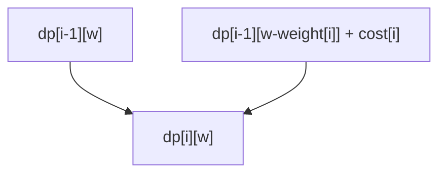

# Задача о рюкзаке. Жадный и динамический подходы

## 1. Почему задача о рюкзаке настолько важна

Рюкзак — это одна из самых знаковых задач во всём курсе алгоритмов.
Она важна сразу по нескольким причинам:

- это очень чистая постановка оптимизационной задачи;
- она показывает, почему красивый жадный выбор может быть ложным;
- она даёт один из самых канонических примеров двумерного `DP`;
- у неё много вариантов: `0/1`, неограниченный, дробный, многомерный.

Если `LCS` учит двумерной динамике на строках, то рюкзак учит двумерной
динамике на **выборе подмножества с ограничением по ресурсу**.

## 2. Постановка классической задачи

Есть:

- `n` предметов;
- у каждого предмета есть вес `w[i]`;
- у каждого предмета есть стоимость `c[i]`;
- рюкзак вместимости `W`.

Нужно выбрать подмножество предметов так, чтобы:

- суммарный вес не превышал `W`;
- суммарная стоимость была максимальной.

### Что означает `0/1`

Каждый предмет можно:

- либо взять один раз;
- либо не брать вообще.

Дробить предмет нельзя. Брать несколько копий тоже нельзя.

## 3. Почему задача не сводится к одной локальной эвристике

Наивно хочется рассуждать жадно:

- брать самый дорогой предмет;
- брать самый лёгкий;
- брать с лучшим отношением `цена / вес`.

Но в `0/1`-рюкзаке это не гарантирует оптимума.

Причина глубокая:

> ценность решения определяется не одним предметом, а сочетанием нескольких
> предметов в условиях жёсткого ограничения на суммарный вес.

То есть задача про **комбинации**, а не про локальные выборы.

## 4. Главная идея динамики

Чтобы решить задачу честно, нужно учитывать два параметра:

- сколько предметов мы уже рассмотрели;
- какой весовой лимит сейчас доступен.

Отсюда естественно рождается состояние:

```text
dp[i][w] = максимальная стоимость,
           которую можно получить,
           рассматривая первые i предметов
           и имея ограничение по весу w
```

Очень важно: здесь `w` — не “уже занятый вес”, а именно доступная вместимость
для текущей подзадачи.

## 5. Почему состояние именно такое

Нужно хранить достаточно информации, чтобы корректно принимать решение по
следующему предмету.

Если бы мы хранили только:

```text
dp[i] = лучший ответ на первых i предметах
```

этого было бы недостаточно: мы бы не знали, сколько веса уже потрачено, а это
критично влияет на возможность взять следующий предмет.

Поэтому второе измерение — вместимость или остаток ресурса — здесь не
роскошь, а необходимость.

## 6. Переход

Рассмотрим `i`-й предмет.

Для состояния `dp[i][w]` есть два варианта:

### 6.1. Не брать предмет

Тогда ответ такой же, как и без него:

```text
dp[i][w] = dp[i-1][w]
```

### 6.2. Взять предмет

Это можно сделать, только если:

```text
w[i] <= w
```

Тогда:

```text
dp[i][w] = dp[i-1][w - weight[i]] + cost[i]
```

### 6.3. Берём максимум

Итоговый переход:

```text
dp[i][w] = max(
  dp[i-1][w],
  dp[i-1][w - weight[i]] + cost[i]
)
```

если предмет помещается.

Иначе:

```text
dp[i][w] = dp[i-1][w]
```

## 7. Почему переход корректен

Это один из самых красивых примеров “полного разбиения случаев”.

Для каждого предмета в любом оптимальном решении ровно одна из двух ситуаций:

- предмет не взят;
- предмет взят.

Третьего варианта нет.

Если предмет не взят, задача сводится к предыдущим предметам с тем же лимитом.
Если взят — стоимость этого предмета добавляется, а лимит уменьшается на его
вес.

Именно поэтому формула не просто правдоподобна, а исчерпывает все варианты.

## 8. База

Если предметов нет, то максимальная стоимость равна нулю:

```text
dp[0][w] = 0
```

Если вместимость нулевая, тоже ничего не унесёшь:

```text
dp[i][0] = 0
```

Это и формирует нулевую строку и нулевой столбец таблицы.

## 9. Геометрия таблицы

Таблица `dp` имеет размер:

```text
(n + 1) x (W + 1)
```

Ось `i` отвечает за число рассмотренных предметов.
Ось `w` — за доступную вместимость.

Каждая клетка смотрит:

- либо наверх;
- либо “наверх и левее” по весу предмета.



## 10. Небольшой пример

Пусть:

- вместимость `W = 5`;
- предметы:
  - `(weight=2, cost=3)`
  - `(weight=3, cost=4)`
  - `(weight=4, cost=5)`

Тогда:

- один предмет весом 2 даёт стоимость 3;
- предмет весом 3 даёт 4;
- первые два вместе дают вес 5 и стоимость 7;
- третий предмет отдельно даёт 5.

Оптимум:

```text
7
```

То есть лучший выбор — взять первый и второй предмет.

Это хороший пример того, что оптимум может возникать не из самого “дорогого”
предмета, а из удачной комбинации.

## 11. Реализация на C++

```cpp
int Knapsack01(
    const std::vector<int>& weight,
    const std::vector<int>& cost,
    int capacity) {
  const int n = static_cast<int>(weight.size());
  std::vector<std::vector<int>> dp(
      n + 1, std::vector<int>(capacity + 1, 0));

  for (int i = 1; i <= n; ++i) {
    for (int w = 0; w <= capacity; ++w) {
      dp[i][w] = dp[i - 1][w];
      if (weight[i - 1] <= w) {
        dp[i][w] = std::max(
            dp[i][w],
            dp[i - 1][w - weight[i - 1]] + cost[i - 1]);
      }
    }
  }

  return dp[n][capacity];
}
```

## 12. Восстановление выбранных предметов

Чтобы получить не только стоимость, но и сами предметы, можно идти назад из
`dp[n][W]`.

Если:

```text
dp[i][w] == dp[i-1][w]
```

значит `i`-й предмет не был взят.

Иначе — был взят, и тогда:

- добавляем его в ответ;
- переходим в состояние:

```text
(i - 1, w - weight[i])
```

## 13. Почему рюкзак особенно хорош для обучения

В рюкзаке очень ясно видно, как устроена логика `DP`:

- состояние описывает подзадачу;
- переход перебирает два осмысленных случая;
- ответ в каждой ячейке — лучший среди допустимых альтернатив.

Это одна из самых чистых постановок принципа Беллмана:

> оптимальное решение строится из оптимальных решений подзадач.

## 14. Сложность

Для таблицы размера `(n + 1) x (W + 1)`:

- время: `O(nW)`;
- память: `O(nW)`.

Это псевдополиномиальная сложность:

- она полиномиальна по `n` и `W`;
- но не по длине записи числа `W`.

Это важная теоретическая тонкость.

## 15. Оптимизация памяти до `O(W)`

Можно хранить только один массив:

```text
dp[w] = лучший ответ для текущего набора предметов и вместимости w
```

Но тогда нужно обновлять веса **справа налево**:

```cpp
for (int i = 0; i < n; ++i) {
  for (int w = capacity; w >= weight[i]; --w) {
    dp[w] = std::max(dp[w], dp[w - weight[i]] + cost[i]);
  }
}
```

Почему справа налево?

Чтобы текущий предмет не использовался несколько раз в одном и том же слое.

Это очень важная тонкость, которую полезно понимать, а не просто запоминать.

## 16. Чем `0/1`-рюкзак отличается от неограниченного

В неограниченном рюкзаке предмет можно брать много раз.
Тогда переход уже использует текущий слой иначе:

```text
dp[w] = max(dp[w], dp[w - weight[i]] + cost[i])
```

но порядок обхода веса меняется.

Это хороший пример того, как малое изменение условия меняет правильную механику
динамики.

## 17. Где жадный подход всё-таки работает

Если предмет можно делить на части, возникает **дробный рюкзак**.

Там оптимален greedy по отношению:

```text
cost / weight
```

То есть:

- сначала берём самые выгодные по плотности стоимости предметы;
- последний предмет можно взять частично.

Очень важно не путать эти две задачи:

- `0/1 knapsack` — динамика;
- fractional knapsack — greedy.

## 18. Типичные ошибки

- перепутать `0/1`-рюкзак и дробный;
- обновлять одномерный массив слева направо и случайно разрешить брать предмет
  много раз;
- неверно трактовать смысл `dp[i][w]`;
- забыть базу при нулевой вместимости;
- пытаться применять greedy без доказательства.

## 19. Что важно запомнить

Задача о рюкзаке — это не просто “ещё одна динамика”, а почти эталон задач на
выбор подмножества под ограничением ресурса.

Она учит:

1. как строить состояние из “количества рассмотренных объектов” и “остатка
   ресурса”;
2. как писать переход по принципу “взять / не взять”;
3. почему жадные идеи могут быть опасны там, где важны комбинации.
