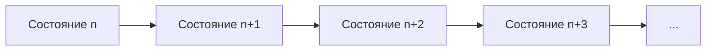

# ДП на матрицах. Числа Фибоначчи

## 1. Почему у чисел Фибоначчи вообще появляется матрица

Обычно числа Фибоначчи изучают как простейшую рекурсию:

```text
F(n) = F(n-1) + F(n-2)
```

Но эта же формула скрывает намного более глубокую идею:

> если новое состояние линейно выражается через фиксированное число предыдущих
> состояний, переход можно записать в виде умножения на матрицу.

Это невероятно важная мысль, потому что она открывает путь:

- от обычной одномерной динамики;
- к матричному представлению перехода;
- а затем к ускорению через быстрое возведение матрицы в степень.

## 2. Обычная динамика для Фибоначчи

Базовая `DP`-версия выглядит так:

```text
F(0) = 0
F(1) = 1
F(n) = F(n-1) + F(n-2)
```

Её можно посчитать:

- за `O(n)` времени;
- за `O(1)` памяти, если хранить только два последних значения.

Это уже хорошо.

Но если `n` очень велико, хочется быстрее, чем линейно.

## 3. Как понять, что тут возможна матрица

Проблема в том, что одного числа `F(n)` недостаточно, чтобы перейти к
следующему. Для вычисления `F(n+1)` нужен ещё `F(n-1)` или как минимум пара
соседних значений.

Значит естественно хранить не одно число, а **вектор состояния**.

Например:

```text
[F(n+1)]
[F(n)  ]
```

Теперь переход от шага `n` к шагу `n+1` должен превращать этот вектор в новый.

## 4. Построение матрицы перехода

Нужно выразить:

```text
[F(n+2)]
[F(n+1)]
```

через:

```text
[F(n+1)]
[F(n)  ]
```

По определению Фибоначчи:

```text
F(n+2) = F(n+1) + F(n)
F(n+1) = 1 * F(n+1) + 0 * F(n)
```

Значит:

```text
[F(n+2)]   [1 1] [F(n+1)]
[F(n+1)] = [1 0] [F(n)  ]
```

Вот и матрица перехода:

```text
A =
[1 1]
[1 0]
```

## 5. Что означает матрица перехода

Эта матрица — просто компактная запись правила:

- новая верхняя координата — сумма двух старых;
- новая нижняя координата — копия старой верхней.

То есть матрица — не “магия”, а упаковка обычного перехода `DP` в линейную
алгебру.

## 6. Один шаг, два шага, много шагов

Если один шаг задаётся умножением на `A`, то:

- два шага — это `A^2`;
- три шага — `A^3`;
- `k` шагов — `A^k`.

Следовательно:

```text
[F(n+1)]   [1 1]^n [F(1)]
[F(n)  ] = [1 0]   [F(0)]
```

То есть задача вычисления большого `F(n)` превращается в задачу быстро
вычислить степень матрицы.

## 7. Почему это ускоряет вычисление

Если просто перемножать матрицу `n` раз, будет всё ещё `O(n)`.
Но матрицу можно возводить в степень бинарным методом:

- если степень чётная, квадратируем основание;
- если нечётная, домножаем на основание;
- двигаемся по битам числа.

Это даёт:

```text
O(log n)
```

матричных умножений.

## 8. Аналогия с быстрым возведением в степень

Для чисел:

```text
a^13 = a * (a^2)^2 * (a^8)
```

То же самое делается и для матриц.

Разница только в том, что вместо обычного умножения чисел происходит умножение
матриц `2 x 2`.

## 9. Почему это всё ещё динамика

Иногда кажется, что как только появились матрицы, динамика закончилась.
На самом деле нет.

Мы всё ещё имеем:

- состояние;
- фиксированный переход;
- многократное применение перехода.

Просто вместо явного вычисления:

```text
dp[2], dp[3], dp[4], ...
```

мы “сжимаем” много одинаковых шагов в одну матричную степень.

То есть матричный метод — это по сути ускоренная форма линейной динамики.

## 10. Реализация умножения и бинарного возведения

```cpp
struct Matrix {
  long long a00, a01, a10, a11;
};

Matrix Multiply(const Matrix& x, const Matrix& y) {
  return {
      x.a00 * y.a00 + x.a01 * y.a10,
      x.a00 * y.a01 + x.a01 * y.a11,
      x.a10 * y.a00 + x.a11 * y.a10,
      x.a10 * y.a01 + x.a11 * y.a11};
}

Matrix Power(Matrix base, long long exp) {
  Matrix result{1, 0, 0, 1};  // единичная матрица
  while (exp > 0) {
    if (exp & 1LL) {
      result = Multiply(result, base);
    }
    base = Multiply(base, base);
    exp >>= 1LL;
  }
  return result;
}

long long Fibonacci(long long n) {
  if (n == 0) {
    return 0;
  }
  Matrix fib{1, 1, 1, 0};
  Matrix p = Power(fib, n - 1);
  return p.a00;  // F(n)
}
```

## 11. Почему формула для `F(n)` именно такая

Если:

```text
A^(n-1) * [F(1)] = [F(n)  ]
          [F(0)]   [F(n-1)]
```

а:

```text
[F(1)] = [1]
[F(0)]   [0]
```

то верхняя левая компонента матрицы `A^(n-1)` и даст `F(n)`.

## 12. Сложность

Матрицы размера `2 x 2` умножаются за константу.

Число умножений:

```text
O(log n)
```

Значит итоговая сложность:

```text
O(log n)
```

Это радикальное улучшение по сравнению с `O(n)`.

## 13. Почему это не просто трюк для Фибоначчи

Главная ценность темы не в том, чтобы знать ещё один способ считать Фибоначчи.
Главная ценность в следующем:

> если переход между состояниями линейный и зависит от фиксированного числа
> прошлых состояний, возможно матричное ускорение.

Это распространяется на:

- линейные рекуррентные последовательности;
- некоторые задачи на графы;
- подсчёт путей;
- динамику по фиксированному числу слоёв памяти.

## 14. Геометрическая интуиция

Можно думать так:

- обычная динамика делает один шаг за раз;
- матричная динамика учится быстро “перематывать” много одинаковых шагов.



Матрица кодирует один переход, а степень матрицы — сразу много переходов.

## 15. Типичные ошибки

- неверно выбрать вектор состояния;
- перепутать порядок координат;
- ошибиться в единичной матрице;
- перепутать `n` и `n - 1` в степени;
- считать, что это уже не `DP`, хотя по смыслу это та же динамика.

## 16. Что важно запомнить

Матричный метод для Фибоначчи важен как первый большой мост между:

- динамическим программированием;
- линейной алгеброй;
- быстрым возведением в степень.

Он учит видеть не только формулу ответа, но и структуру перехода между
состояниями.
